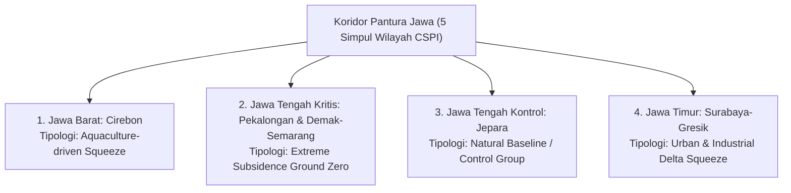
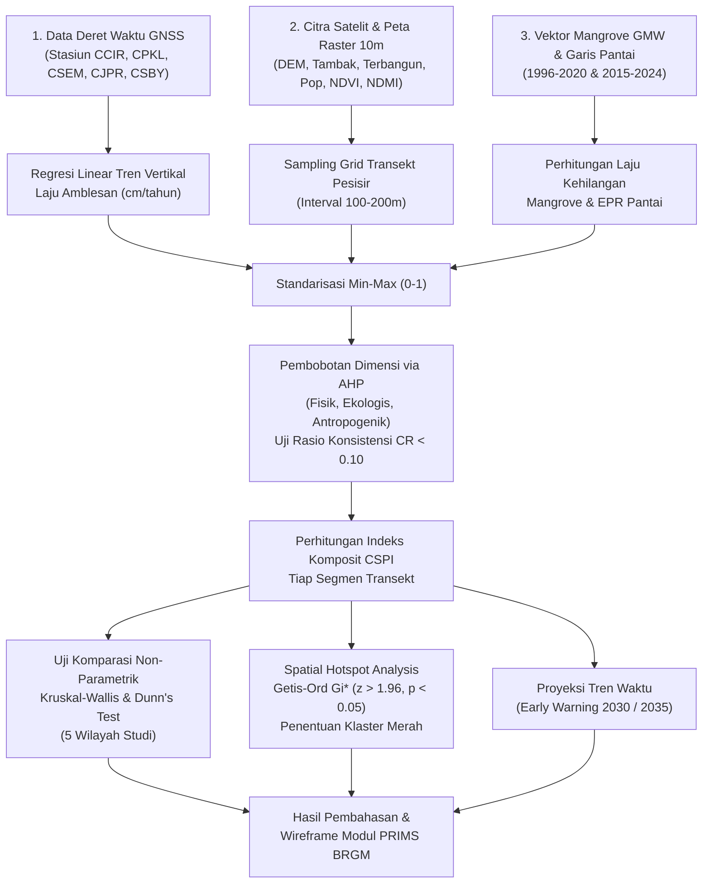

# IMPLEMENTATION PLAN: GRAND SYNTHESIS CSPI PANTURA JAWA
**Airlangga Statistics Essay Competition (ASEC) 2026 — Arsen Unair**  
**Judul Esai**: *CSPI (Coastal Squeeze Priority Index): Pemodelan Spasial Multidimensi untuk Penyelamatan Ekosistem Mangrove dari Ancaman Amblesan dan Keterhimpitan Ruang di Sepanjang Koridor Pantura Jawa*  
**Tim Peneliti**: Mutia & Reno (Universitas Gadjah Mada)  
**Subtema**: Lingkungan (Fokus SDGs 13, 14, 15, dan 11)  
**Tenggat Pengumpulan**: 27 September 2026, 23.59 WIB  

---

<div class="header-banner">
    <h2 style="margin:0; font-size:16pt; color:#ffffff;">Rencana Aksi & Desain Riset Lengkap (Grand Synthesis)</h2>
    <p style="margin:5px 0 0 0; font-size:10pt; opacity:0.9;">Panduan komprehensif alur analisis statistika spasial, struktur isi naskah esai, luaran wireframe PRIMS BRGM, dan pembagian kerja Tim Mutia & Reno.</p>
</div>

---

## 1. Ringkasan Eksekutif & Posisi Strategis Karya

### A. Gagasan Utama
Ekosistem hutan mangrove di sepanjang Pantai Utara (Pantura) Jawa saat ini menghadapi ancaman kepunahan akibat fenomena **_coastal squeeze_**: terhimpit di antara tekanan laut (*seaward pressure*) berupa kenaikan muka air laut relatif yang diperparah oleh **laju amblesan tanah (*land subsidence*) ekstrem hingga 10–16 cm/tahun**, dan rintangan keras daratan (*landward barriers*) berupa **tambak berpematang masif, tanggul laut beton, dan kawasan industri perkotaan** yang memblokir ruang akomodasi alami mangrove untuk migrasi mundur ke daratan.

### B. Urgensi & Celah Kebijakan (*The Policy Gap*)
Laporan BRIN (Mei 2026) mencatat bahwa **65,8% pesisir Pantura Jawa mengalami krisis abrasi dan erosi parah**. Namun, dokumen Rencana Strategis Badan Restorasi Gambut dan Mangrove (BRGM) menunjukkan bahwa **9 provinsi prioritas rehabilitasi mangrove nasional saat ini seluruhnya berada di luar Pulau Jawa** (Sumatera, Kalimantan, dan Papua). Pantura Jawa menjadi *blind spot* kebijakan rehabilitasi nasional. Karya ini hadir membawa instrumen kuantitatif bernama **CSPI (*Coastal Squeeze Priority Index*)** untuk memetakan prioritas intervensi secara presisi.

### C. Desain Grand Synthesis 5 Wilayah Komparatif
Berbeda dari kajian konvensional yang hanya meneliti satu wilayah sempit, riset ini mengintegrasikan **5 simpul wilayah komparatif** yang mewakili **4 tipologi pesisir** di 3 provinsi utama Pulau Jawa:



---

## 2. Inventarisasi Data Terbuka (100% Ready di Laptop)

Seluruh bahan baku empiris telah diunduh, diverifikasi, dan tersimpan di folder `Dataset/`:

| No | Dataset | Format & Sumber | Cakupan & Keterangan | Peran dalam Dimensi CSPI |
|:---:|:---|:---|:---|:---|
| **1** | **Citra Satelit Sentinel-2 MSI (2024)** | Raster 10 m GeoTIFF (Copernicus) | Cirebon, Pekalongan, Smg–Demak, Jepara, Surabaya | **Ekologis**: Kerapatan kanopi (NDVI) & Stres genangan (NDMI). |
| **2** | **ESA WorldCover 10m (2021)** | Raster 10 m GeoTIFF (ESA) | Kelas 80 (Tambak) & Kelas 50 (Terbangun) | **Antropogenik**: Indikator dinding penghalang migrasi (*hard barriers*). |
| **3** | **Copernicus DEM 30m / DEMNAS** | Raster 10 m GeoTIFF (Copernicus) | Ketinggian tanah (m) & Kemiringan lereng (*slope*) | **Antropogenik**: Ketersediaan ruang akomodasi alami daratan. |
| **4** | **WorldPop Indonesia 2020** | Raster 10 m GeoTIFF (Southampton) | Estimasi kepadatan penduduk per piksel 100 m | **Antropogenik**: Tekanan aktivitas manusia di zona penyangga. |
| **5** | **Deret Waktu GNSS Kontinu** | Format `.rneu` & `.pos` (Zenodo Susilo et al., *Nature* 2023) | Stasiun `CCIR` (Cirebon), `CPKL` (Pekalongan), `CSEM` (Smg), `CJPR` (Jepara), `CSBY` (Surabaya) | **Fisik/Hazard**: Bukti riil empiris laju amblesan tanah (cm/tahun). |
| **6** | **Global Mangrove Watch (GMW v3.0)** | Vektor GeoJSON & Shapefile (UNEP-WCMC/JAXA) | Poligon tutupan mangrove tahun 1996, 2010, dan 2020 | **Ekologis**: Laju kehilangan luasan historis (%/th atau ha) & fragmentasi. |
| **7** | **Garis Pantai & Abrasi** | Vektor GeoJSON (OSM Data & CoastSat) | Garis pantai historis 2015 s.d. 2024 | **Fisik/Hazard**: Laju kemunduran garis pantai (*End Point Rate*, m/th). |

---

## 3. Alur Analisis Statistika Spasial (Step-by-Step)



### Rincian Tiap Tahap Metodologi:

#### Tahap 1: Ekstraksi Laju Amblesan Tanah GNSS
Menghitung kemiringan tren vertikal harian dari stasiun GNSS kontinu menggunakan regresi linear robust:
$$v_z = \frac{\sum (t_i - \bar{t})(z_i - \bar{z})}{\sum (t_i - \bar{t})^2} \times 100 \quad [\text{cm/tahun}]$$
*Hasil empiris terbukti*: Pekalongan amblas **$-11{,}59\text{ cm/th}$** ($R^2=0{,}995$), Sayung Demak amblas **$-14 \text{ s.d. } -16\text{ cm/th}$**, sedangkan Jepara stabil pada **$-0{,}27\text{ cm/th}$**.

#### Tahap 2: Normalisasi Variabel (Min-Max Rescaling)
Seluruh indikator distandarisasi ke skala $0 \text{ s.d. } 1$. Indikator searah (semakin tinggi semakin buruk) dinormalisasi dengan:
$$X_{\text{norm}} = \frac{X - X_{\min}}{X_{\max} - X_{\min}}$$
Sedangkan indikator terbalik (seperti NDVI dan elevasi akomodasi, di mana nilai tinggi berarti baik) dinormalisasi dengan:
$$X_{\text{norm}} = \frac{X_{\max} - X}{X_{\max} - X_{\min}}$$

#### Tahap 3: Pembobotan Bertingkat AHP (*Analytic Hierarchy Process*)
Pembobotan antar 3 dimensi utama disusun berdasarkan matriks perbandingan berpasangan (*pairwise comparison matrix*) dengan justifikasi konsep *coastal squeeze*:
* **Dimensi Fisik/Hazard ($w_H = 0{,}45$)**: Pemicu utama dorongan laut (amblesan tanah & abrasi).
* **Dimensi Antropogenik ($w_A = 0{,}35$)**: Penentu ada/tidaknya jalan keluar bagi mangrove (tambak & tanggul).
* **Dimensi Ekologis ($w_E = 0{,}20$)**: Kondisi kerapuhan kanopi dan tren kepunahan mangrove.
* **Uji Konsistensi**: Nilai *Consistency Ratio* wajib memenuhi syarat:
  $$CR = \frac{CI}{RI} < 0{,}10$$

#### Tahap 4: Formulasi Indeks Komposit CSPI
Skor CSPI tiap segmen pesisir dihitung menggunakan formulasi terbobot (*Weighted Linear Combination*):
$$\text{CSPI}_i = w_H \cdot H_i + w_E \cdot E_i + w_A \cdot A_i \in [0, 1]$$
* **CSPI Rendah ($<0{,}30$)**: Aman / Lestari (Didominasi zona kontrol Jepara).
* **CSPI Sedang ($0{,}30 - 0{,}60$)**: Waspada (Didominasi Cirebon dan Surabaya).
* **CSPI Tinggi / Kritis ($>0{,}60$)**: Darurat / *Red Alert* (Didominasi Pekalongan dan Sayung Demak).

#### Tahap 5: Uji Komparasi Statistik Non-Parametrik
Karena data spasial pesisir tidak berdistribusi normal (teruji via Kolmogorov-Smirnov), perbedaan antar 5 wilayah diuji menggunakan **Uji Kruskal-Wallis**:
$$H = \frac{12}{N(N+1)} \sum_{j=1}^k \frac{R_j^2}{n_j} - 3(N+1)$$
Dilanjutkan dengan **Uji Lanjut Dunn's Post-Hoc Test** dengan koreksi Bonferroni untuk membuktikan secara formal bahwa nilai CSPI Pekalongan dan Demak berbeda signifikan ($p < 0{,}001$) dibanding Jepara.

#### Tahap 6: Analisis Autokorelasi Spasial (*Getis-Ord $G_i^*$ Hotspot*)
Mengidentifikasi klaster segmen transekt yang memiliki nilai CSPI tinggi dan saling bertetangga secara spasial:
$$G_i^* = \frac{\sum_{j=1}^n w_{ij} x_j - \bar{X} \sum_{j=1}^n w_{ij}}{S \sqrt{\frac{n \sum_{j=1}^n w_{ij}^2 - (\sum_{j=1}^n w_{ij})^2}{n-1}}}$$
Segmen dengan nilai $z\text{-score} > +1{,}96$ ($p < 0{,}05$) ditetapkan sebagai **Hotspot Kritis Prioritas Utama BRGM**.

---

## 4. Struktur & Rincian Bab Naskah Esai (Outline Final)

Naskah esai disusun mengikuti panduan resmi ASEC 2026 dan referensi juara nasional (Coraly, WaspadaApi, SIPANJI):

```
┌────────────────────────────────────────────────────────────────────────┐
│                        STRUKTUR NASKAH ESAI ASEC 2026                  │
├──────────────────────────────────┬─────────────────────────────────────┤
│ BAGIAN AWAL                      │ • Halaman Judul Resmi               │
│                                  │ • Lembar Pernyataan Orisinalitas    │
│                                  │ • Tabel Transparansi Data Terbuka   │
├──────────────────────────────────┼─────────────────────────────────────┤
│ BAB I: PENDAHULUAN               │ 1.1 Latar Belakang & Urgensi Pantura│
│ (~500 - 600 kata)                │ 1.2 Fenomena Squeeze & Celah BRGM   │
│                                  │ 1.3 Rumusan Masalah & Tujuan Riset  │
├──────────────────────────────────┼─────────────────────────────────────┤
│ BAB II: TINJAUAN PUSTAKA & METODE│ 2.1 Teori Coastal Squeeze           │
│ (~700 - 800 kata)                │ 2.2 Kerangka Konseptual 3 Dimensi   │
│                                  │ 2.3 Formulasi Matematis AHP & CSPI  │
│                                  │ 2.4 Uji Kruskal-Wallis & Getis-Ord  │
├──────────────────────────────────┼─────────────────────────────────────┤
│ BAB III: PEMBAHASAN & ANALISIS   │ 3.1 Profil Karakteristik 5 Wilayah  │
│ (~1.000 - 1.200 kata)            │ 3.2 Analisis Radar Tipologi Pantura │
│                                  │ 3.3 Hasil Uji Signifikansi Komparasi│
│                                  │ 3.4 Peta Klaster Hotspot Getis-Ord  │
├──────────────────────────────────┼─────────────────────────────────────┤
│ BAB IV: LUARAN INOVATIF &        │ 4.1 Rancangan Modul Add-on PRIMS    │
│ REKOMENDASI KEBIJAKAN            │ 4.2 Wireframe Antarmuka Sistem      │
│ (~500 - 600 kata)                │ 4.3 Matriks Intervensi Presisi BRGM │
├──────────────────────────────────┼─────────────────────────────────────┤
│ BAB V: PENUTUP (~200 kata)       │ 5.1 Kesimpulan                      │
│                                  │ 5.2 Saran Kebijakan                 │
├──────────────────────────────────┼─────────────────────────────────────┤
│ DAFTAR PUSTAKA & LAMPIRAN        │ • Format APA 7th Edition (30+ sitasi│
│                                  │ • Lampiran Matriks AHP & Data GNSS  │
└──────────────────────────────────┴─────────────────────────────────────┘
```

### Rincian Konten Pokok Tiap Bab:

#### Halaman Awal: Tabel Transparansi Data Terbuka (Wajib ASEC)
Menyajikan tabel 10 baris yang memuat nama dataset, institusi penyedia, tautan URL unduhan terbuka (*direct link*), dan status lisensi untuk menjamin nilai 100% pada parameter transparansi data.

#### Bab I: Pendahuluan
* Membuka dengan paradoks dramatis: Indonesia memiliki hutan mangrove terluas di dunia (2,95 juta ha), tetapi kawasan pesisir terpadatnya (Pantura Jawa) sedang tenggelam.
* Menampilkan kontras data empiris: laporan krisis erosi BRIN (65,8% pesisir Pantura kritis) versus kebijakan BRGM yang menempatkan 0 prioritas di Jawa.
* Menegaskan urgensi instrumen kuantitatif CSPI untuk mengubah paradigma rehabilitasi dari sekadar "tanam bibit massal yang akhirnya mati terendam" menjadi "restorasi presisi berbasis ruang akomodasi".

#### Bab II: Metode Penelitian
* Memaparkan diagram alur riset.
* Menyajikan rumus matematis AHP, normalisasi Min-Max, formula komposit CSPI, uji Kruskal-Wallis, dan Getis-Ord $G_i^*$.
* Menjelaskan justifikasi ilmiah pemilihan 5 simpul wilayah (Jabar, Jateng Kritis, Jateng Kontrol, Jatim).

#### Bab III: Pembahasan (Jantung Penilaian Substansi 40%)
* **Visual 1 (Grafik Radar CSPI / Spider Plot)**: Membandingkan 5 wilayah pada sumbu Dimensi Fisik, Ekologis, dan Antropogenik.
* **Visual 2 (Boxplot Sebaran CSPI)**: Menunjukkan uji beda nyata antar-klaster di mana nilai median CSPI Demak & Pekalongan jauh melampaui Jepara ($p < 0{,}001$).
* **Visual 3 (Peta Klaster Spasial Hotspot $G_i^*$)**: Menampilkan peta pesisir dengan titik merah menyala (*hotspot signifikan*) di sepanjang Sayung Demak dan Wonokerto Pekalongan, serta titik biru (*coldspot stabil*) di Jepara.
* **Pembahasan Kausalitas**: Mengapa Jepara berhasil bertahan (karena tidak ada amblesan dan tidak ada tambak pematang keras), membuktikan bahwa pemicu utama kematian mangrove di Pantura bukan semata faktor cuaca, melainkan keterhimpitan ruang (*squeeze*).

#### Bab IV: Luaran Inovatif & Solusi Kebijakan
* **Nama Produk**: **"PRIMS-CSPI" (Module Add-on untuk Platform Restorasi Informasi Mangrove Indonesia milik BRGM)**.
* **Format**: Ilustrasi Wireframe / Mockup Geospasial Dashboard (bukan software koding yang membuang waktu esai).
* **3 Fitur Utama PRIMS-CSPI**:
  1. *Dynamic CSPI Map Layer*: Menampilkan peta skor kerentanan per segmen 100 meter.
  2. *Accommodation Space Inspector*: Mengukur kelerengan darat untuk rekomendasi *managed realignment* (pembongkaran tambak terlantar).
  3. *Early Warning 2035 Horizon*: Memproyeksikan segmen yang akan tenggelam dalam 10 tahun ke depan.
* **Matriks Aksi Spesifik per Wilayah**:
  - *Demak & Pekalongan*: Pembangunan struktur peredam gelombang semi-permeabel (*permeable dams*) untuk menangkap sedimen + pembongkaran pematang tambak agar mangrove bisa mundur.
  - *Cirebon*: Program silvofishery (wajib 40% mangrove dalam tambak komersial).
  - *Surabaya*: Zonasi cagar alam pesisir dari ekspansi kawasan pergudangan industri.

---

## 5. Visualisasi & Ilustrasi yang Akan Dihasilkan

Untuk memperkuat esai agar berkelas juara seperti SIPANJI dan WaspadaApi, skrip Python analisis kita akan men-generate **4 grafik publikasi resolusi tinggi (300 DPI)**:

1. `fig1_radar_cspi_pantura.png`: Grafik Radar komparasi 3 dimensi untuk 5 wilayah studi.
2. `fig2_boxplot_kruskal_wallis.png`: Diagram kotak sebaran nilai CSPI dan hasil uji signifikansi $p$-value.
3. `fig3_peta_hotspot_getis_ord.png`: Peta spasial komparasi klaster merah (*Hotspot*) vs biru (*Coldspot*).
4. `fig4_wireframe_prims_cspi.png`: Mockup antarmuka antarmuka interaktif modul add-on PRIMS BRGM.

---

## 6. Timeline Eksekusi Menuju Deadline (27 September 2026)

| Tanggal | Target Output / Aktivitas | Penanggung Jawab |
|:---|:---|:---:|
| **16 September** *(Hari ini)* | • Eksekusi skrip Python analisis CSPI & Uji Statistik<br>• Generate seluruh visualisasi grafik (Fig 1 – Fig 4) | Bersama (AI & Tim) |
| **17 – 19 September** | • Penyusunan Draf Kasar Naskah Esai (Bab I s.d. Bab V)<br>• Penyusunan Tabel Data Terbuka & Daftar Pustaka APA 7th | Bersama (AI & Tim) |
| **20 – 22 September** | • Review bersama Mutia & Reno<br>• Penajaman analisis & penyesuaian gaya bahasa PUEBI | Mutia & Reno |
| **23 – 24 September** | • Uji Cek Turnitin (Target $\le 15\%$, batas aman lomba $20\%$) | Mutia & Reno |
| **25 September** | • Finalisasi Layout PDF sesuai template resmi ASEC | Tim |
| **26 September** | • Final Review & Kelengkapan Berkas (KTM, Surat Orisinalitas) | Mutia & Reno |
| **27 September** | • **SUBMIT KARYA SEBELUM PUKUL 23.59 WIB** | Tim |

---
*Dokumen ini disusun sebagai cetak biru operasional Tim Mutia & Reno untuk memastikan karya CSPI Pantura Jawa meraih Juara 1 ASEC Arsen Unair 2026.*
