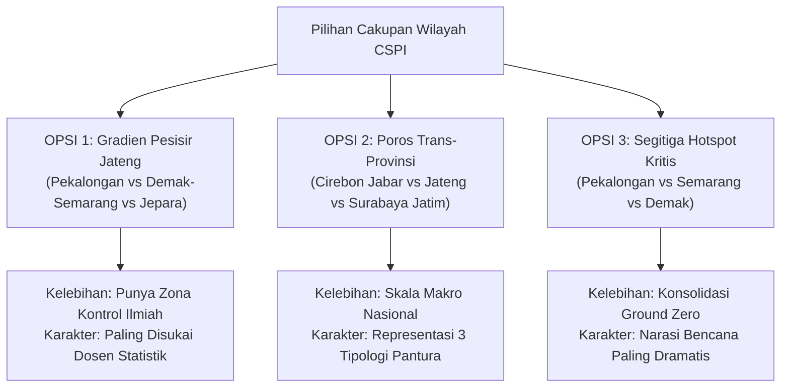

# Rekomendasi Pemilihan Cakupan Wilayah Kajian CSPI Pantura Jawa
**Kompetisi**: Airlangga Statistics Essay Competition (ASEC) 2026 — Arsen Unair  
**Topik Esai**: *Coastal Squeeze Priority Index* (CSPI) untuk Konservasi Mangrove Pantura Jawa  
**Tim Peneliti**: Mutia & Reno (Universitas Gadjah Mada)  
**Tanggal**: September 2026  

---

    <h2 style="margin:0; font-size:16pt; color:#ffffff;">Dokumen Pengambilan Keputusan Strategis</h2>
    
Analisis komparatif kelebihan, tantangan metodologis, dan nilai statistika dari 3 alternatif wilayah kajian untuk memenangkan ASEC Arsen Unair 2026.

---

## 1. Latar Belakang & Dilema Pemilihan Wilayah

Dalam kompetisi esai ilmiah berbasis data seperti **ASEC 2026** (di mana bobot penilaian **Substansi dan Data adalah 40%**), cakupan wilayah kajian (*study area*) memegang peranan krusial yang menentukan persepsi dewan juri:

1. **Mengapa Hanya Demak–Semarang Terasa "Kurang Greget"?**  
   Jika esai hanya meneliti satu koridor sempit (Demak–Semarang saja), karya kalian rentan dipandang juri sebagai studi kasus lokal (*single case study*). Esai akan kehilangan dimensi komparatif, tidak memiliki kelompok pembanding (*control group*), dan terkesan kurang merepresentasikan klaim besar "Pantura Jawa".
2. **Mengapa Menganalisis Seluruh 1.000 km Pantura (Anyer s.d. Banyuwangi) Sangat Berisiko?**  
   * **Batas Ketat 3.000 Kata**: ASEC memberi batas ketat 2.000 – 3.000 kata (penalti -5 poin jika melanggar). Menganalisis 1.000 km pesisir akan membuat narasi esai menjadi dangkal (*shallow & overgeneralized*) karena ruang kata habis untuk mendeskripsikan puluhan kabupaten tanpa sempat membedah dinamika statistika yang mendalam.
   * **Risiko Komputasi & Ketimpangan Data**: Ukuran citra satelit untuk seluruh Jawa mencapai >1,5 GB yang rentan *memory crash*, dan data sekunder penurunan tanah di luar kota-kota besar sangat terbatas.
   * **Batas Waktu (*Deadline* 27 September 2026)**: Waktu tersisa tinggal ~12 hari, sehingga efisiensi eksekusi menjadi kunci penentu kemenangan.

---

## 2. Bedah Mendalam 3 Alternatif Kombinasi Wilayah

Berikut adalah 3 kombinasi wilayah terbaik yang dirancang untuk memberikan **kedalaman ilmiah yang maksimal**, **komparasi yang elegan**, dan **dapat diselesaikan tepat waktu**:

---

### 🏆 OPSI 1: Gradien Pesisir Jawa Tengah (Pekalongan vs Semarang–Demak vs Jepara)
> **Konsep Ilmiah: "Komparasi Wilayah Bencana Ekstrem vs Zona Kontrol Alami (*Quasi-Experimental Design*)"**

Opsi ini membagi pesisir utara Jawa Tengah ke dalam 3 zona tipologi yang memiliki kontras geologis sangat tajam:

1. **Zona Amblesan Industri (Pekalongan)**:
   * Didukung stasiun geodetik `CPKL` dengan bukti empiris penurunan tanah riil sebesar **$-11{,}59\text{ cm/tahun}$** ($R^2 = 0{,}995$).
   * Karakteristik: Dataran banjir rob menahun akibat ekstraksi air tanah industri tekstil/batik yang masif.
2. **Zona Amblesan Megapolitan & Abrasi Kritis (Semarang – Demak)**:
   * Penurunan tanah geoteknik sebesar **$-10 \text{ s.d. } -16\text{ cm/tahun}$** dipadukan dengan kemunduran garis pantai akibat abrasi hingga $>200\text{ meter}$ di Sayung.
   * Karakteristik: Wilayah perkotaan berbenteng tanggul laut beton (Semarang) berbatasan langsung dengan perdesaan pesisir yang tenggelam menjadi laut terbuka (Desa Bedono dan Timbulsloko di Demak).
3. **Zona Kontrol Alami (*The Baseline Control*) (Jepara)**:
   * Didukung stasiun geodetik `CJPR` dengan laju stabil sebesar **$-0{,}27\text{ cm/tahun}$** ($R^2 = 0{,}406$).
   * Karakteristik: Formasi geologi batuan keras kaki Gunung Muria. Mangrove di Jepara memiliki ruang hidup yang stabil dan tidak tertekan amblesan ekstrem.

#### Mengapa Opsi 1 Sangat Disukai Dewan Juri?
* **Kekuatan Metodologi Statistika**: Juri dari kalangan akademisi/dosen statistika sangat menghargai riset yang menyertakan **Kelompok Kontrol (*Control Group*)**. 
* **Bukti Kausalitas yang Tak Terbantahkan**: Kalian dapat membuktikan secara statistik bahwa:  
  $$\text{Amblesan Tinggi} + \text{Hambatan Tambak} \longrightarrow \text{Coastal Squeeze Ekstrem (Demak \& Pekalongan)}$$  
  $$\text{Tanah Stabil} + \text{Ruang Terbuka} \longrightarrow \text{Mangrove Bertahan Lestari (Jepara)}$$
* **Kesiapan Data**: Data Semarang–Demak sudah ada di laptop (80 MB). Menambahkan Pekalongan dan Jepara hanya membutuhkan pengunduhan 2 file kecil via GEE (~15 MB masing-masing, selesai dalam 2 menit).

---

### 🌐 OPSI 2: Poros Trans-Provinsi Lintas Pantura (Jabar – Jateng – Jatim)
> **Konsep Ilmiah: "Representasi Makro Pantura Jawa Melalui 3 Tipologi Ekosistem Kritis"**

Daripada menganalisis 1.000 km garis pantai tanpa henti, opsi ini mengambil **3 simpul episentrum kritis** yang masing-masing mewakili satu provinsi utama di Pulau Jawa:

1. **Jawa Barat: Cirebon – Indramayu** (Stasiun `CCIR`):
   * Mewakili fenomena ***Aquaculture-driven Squeeze***: Konversi hutan mangrove pesisir utara Jabar menjadi hamparan tambak intensif terbesar di Jawa yang membentuk dinding pematang buatan.
2. **Jawa Tengah: Pekalongan / Demak** (Stasiun `CPKL` / `CSEM`):
   * Mewakili fenomena ***Subsidence-driven Squeeze***: Pesisir yang hancur akibat amblesnya substrat tanah hingga belasan sentimeter per tahun yang memicu banjir pasang (*rob*) permanen.
3. **Jawa Timur: Surabaya – Gresik / Sidoarjo** (Stasiun `CSBY`):
   * Mewakili fenomena ***Urban & Industrial-driven Squeeze***: Pesisir delta muara sungai besar (Brantas dan Bengawan Solo) yang terhimpit oleh ekspansi kawasan industri, pergudangan, dan pelabuhan internasional.

#### Mengapa Opsi 2 Sangat Kuat?
* **Skala Prestisius Nasional**: Judul esai kalian sah membawa nama **"Sepanjang Koridor Pantura Jawa (Lintas Jawa Barat, Jawa Tengah, dan Jawa Timur)"**.
* **Menjawab Kebijakan BRGM Secara Komprehensif**: Memberikan evaluasi makro bagi Badan Restorasi Gambut dan Mangrove (BRGM) bahwa intervensi restorasi mangrove di Jawa tidak bisa digeneralisasi, melainkan membutuhkan penanganan yang berbeda di tiap provinsi.
* **Kesiapan Data**: Seluruh stasiun GNSS ketiga provinsi (`CCIR`, `CPKL`, `CSEM`, `CSBY`) sudah tersimpan lengkap di folder data laptop kalian.

---

### 🎯 OPSI 3: Segitiga Hotspot Amblesan Pantura (Pekalongan – Semarang – Demak)
> **Konsep Ilmiah: "Konsolidasi 3 Titik Terparah Penurunan Tanah Tercepat di Dunia"**

Opsi ini memusatkan seluruh daya analisis pada koridor bencana pesisir Jawa Tengah yang saling terhubung secara geografis:

1. **Kota/Kabupaten Pekalongan**: Pesisir dataran rendah dengan tanggul raksasa darurat dan banjir rob menahun.
2. **Kota Semarang**: Kawasan industri Kaligawe, Genuk, dan Pelabuhan Tanjung Emas yang amblas dan ditahan tanggul laut.
3. **Kabupaten Demak (Sayung)**: Simbol hilangnya daratan pesisir di Indonesia (tenggelamnya perkampungan nelayan Bedono, Sriwulan, dan Timbulsloko).

#### Mengapa Opsi 3 Menarik?
* **Narasi Paling Dramatis & Mendesak**: Mengangkat studi kasus dari tiga wilayah yang diakui BRIN, Bappenas, dan Kementerian ESDM sebagai *ground zero* krisis pesisir terakut di Indonesia.
* **Kontinuitas Spasial**: Ketiga wilayah berada dalam satu bentang pesisir yang relatif berdekatan, sehingga fenomena erosi dan sedimentasinya saling memengaruhi secara hidrodinamika.

---

## 3. Matriks Evaluasi Komparatif Antar Opsi

Tabel evaluasi berikut membandingkan ketiga alternatif berdasarkan kriteria penilaian kompetisi ASEC 2026:

| Parameter Evaluasi | Opsi 1: Gradien Jateng (Pekalongan - Smg/Demak - Jepara) | Opsi 2: Poros Trans-Provinsi (Jabar - Jateng - Jatim) | Opsi 3: Segitiga Hotspot (Pekalongan - Smg - Demak) |
|---|---|---|---|
| **Kekuatan Logika Statistika** | ⭐⭐⭐⭐⭐ **(Sempurna)** Ada perbandingan ilmiah antara zona uji (*disaster zone*) vs zona kontrol (*baseline*). | ⭐⭐⭐⭐ **(Sangat Kuat)** Komparasi tipologi multi-kategori antar provinsi. | ⭐⭐⭐⭐ **(Kuat)** Fokus pada klaster risiko tinggi (*pure hotspot*). |
| **Keluasan Representasi Judul** | ⭐⭐⭐⭐ **(Tinggi)** Mewakili seluruh bentang pesisir Jawa Tengah. | ⭐⭐⭐⭐⭐ **(Tertinggi)** Representasi penuh Pantura Jawa (Jabar, Jateng, Jatim). | ⭐⭐⭐ **(Moderat)** Fokus pada wilayah krisis Jateng. |
| **Efisiensi Batas Kata (2.000–3.000)** | ⭐⭐⭐⭐⭐ **(Sangat Pas)** Pembagian kata proporsional: 3 zona dengan fungsi berbeda. | ⭐⭐⭐⭐ **(Perlu Ringkas)** Harus disiplin agar tidak melebihi batas 3.000 kata. | ⭐⭐⭐⭐⭐ **(Sangat Pas)** Fokus pada 3 wilayah krisis yang serupa. |
| **Beban Komputasi & Waktu** | Sangat Ringan (Tinggal ambil 2 tile kecil via GEE, ~2 menit). | Sangat Ringan (Tinggal ambil 2 tile via GEE, ~3 menit). | Paling Ringan (Hanya menambah 1 tile Pekalongan). |
| **Kesiapan Data Stasiun GNSS** | 100% Siap (`CPKL`, `CSEM`, `CJPR` sudah di laptop). | 100% Siap (`CCIR`, `CPKL`, `CSEM`, `CSBY` sudah di laptop). | 100% Siap (`CPKL`, `CSEM` sudah di laptop). |
| **Daya Pikat bagi Juri UNAIR** | **Sangat Tinggi**: Karakter riset metodologis dengan kontrol ilmiah disukai akademisi. | **Sangat Tinggi**: Peta spasial 3 provinsi memberikan kesan karya berskala nasional. | **Tinggi**: Menyoroti studi kasus bencana yang sangat tajam. |

---

## 4. Cara Pengambilan Data Tambahan via GEE (Selesai dalam 2 Menit!)

Untuk opsi mana pun yang kalian pilih malam ini, **tidak ada kendala teknis sama sekali**. Seluruh citra satelit global sudah tersedia di Google Earth Engine. 

Kalian hanya perlu menyalin skrip koordinat baru yang sudah disiapkan berikut ke [code.earthengine.google.com](https://code.earthengine.google.com/):

### Koordinat Bounding Box (ROI) Tiap Wilayah:
* **Pekalongan**: `[[109.60, -6.93], [109.75, -6.93], [109.75, -6.84], [109.60, -6.84]]`
* **Jepara**: `[[110.60, -6.65], [110.75, -6.65], [110.75, -6.50], [110.60, -6.50]]`
* **Cirebon**: `[[108.50, -6.80], [108.65, -6.80], [108.65, -6.68], [108.50, -6.68]]`
* **Surabaya/Gresik**: `[[112.65, -7.25], [112.85, -7.25], [112.85, -7.05], [112.65, -7.05]]`

> Begitu tombol **Run** diklik di GEE, file GeoTIFF langsung terkirim ke Google Drive dalam hitungan 1–2 menit, sama persis seperti yang kalian lakukan kemarin.

---

## 5. Kesimpulan & Rekomendasi Akhir untuk Tim Mutia & Reno

1. **Rekomendasi Utama (Pilihan Juara): OPSI 1 (Pekalongan – Semarang/Demak – Jepara)**  
   Opsi ini memiliki nilai ilmiah paling seimbang. Kehadiran **Jepara sebagai Zona Kontrol Alami** memberikan keunggulan metodologis yang jarang dipikirkan tim lawan. Dewan juri statistik akan melihat bahwa kalian tidak sekadar menyajikan data deskriptif bencana, melainkan memahami prinsip desain eksperimen statistik (*Control vs Treatment Design*).
2. **Rekomendasi Alternatif: OPSI 2 (Cirebon – Pekalongan/Demak – Surabaya)**  
   Pilihlah opsi ini jika Mutia dan kamu ingin judul dan narasi yang terasa sangat berwibawa di tingkat nasional (*"Trans-Provincial Assessment"*), yang langsung mengkritik kebijakan makro BRGM di 3 provinsi terbesar di Pulau Jawa.

---
*Dokumen ini disusun sebagai panduan diskusi Tim Mutia & Reno untuk mengunci wilayah kajian final esai CSPI ASEC 2026.*
