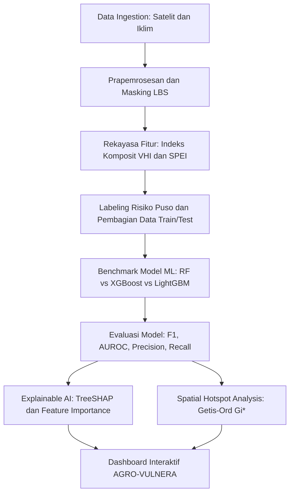

# Rencana Implementasi Topik 1 (Subtema: Ketahanan Pangan)

## 🌾 AGRO-VULNERA: Framework Spatio-Temporal Machine Learning dan Explainable AI Berbasis Indeks Kekeringan Komposit Satelit untuk Prediksi Dini Kerentanan Gagal Panen Padi Sawah dan Asuransi Pertanian Parametrik di Indonesia

---

### 1. Metadata & Identitas Karya
* **Subtema Terpilih (Tunggal)**: **Ketahanan Pangan**
* **Keterkaitan Tema ASEC 2026**: Mengubah data satelit agro-klimatologi yang tersebar (*fragmented realities*) menjadi kejelasan (*clarity*) peta kerentanan puso padi untuk memitigasi dampak volatilitas iklim ekstrem (*global volatility*).
* **Keterkaitan SDGs**:
  * **SDG 2 (Zero Hunger)** – Target 2.4: Memastikan sistem produksi pangan berkelanjutan dan menerapkan praktik pertanian tangguh terhadap perubahan iklim dan cuaca ekstrem.
  * **SDG 1 (No Poverty)** – Target 1.5: Membangun ketahanan petani kecil dari guncangan iklim dan ekonomi.
* **Wilayah Studi / Lokasi Fokus**: Sentra Produksi Padi Nasional (Provinsi Jawa Timur, Jawa Tengah, dan Jawa Barat – atau diperluas ke Sulawesi Selatan) pada tingkat kabupaten/kota atau grid 5 km $\times$ 5 km.

---

### 2. Urgensi Masalah (Why This Matters Now - 2025/2026)
1. **Volatilitas Iklim Ekstrem & Ancaman Swasembada**: Pemerintah Indonesia menargetkan percepatan swasembada pangan nasional. Namun, anomali iklim global (peralihan cepat fenomena ENSO dari El Niño ke anomali kemarau basah/kering serta *flash drought*) telah memicu gagal panen (puso) padi sawah ribuan hektare setiap tahunnya.
2. **Kelemahan Pelaporan Konvensional**: Saat ini pemantauan kekeringan lahan pertanian oleh instansi terkait mengandalkan laporan petugas lapangan secara berjenjang (PPL ke Dinas Pertanian). Hal ini menimbulkan *time-lag* pelaporan hingga berminggu-minggu; bantuan (pompa air, sumur pantek, varietas benih adaptif) baru tiba saat tanaman sudah terlanjur puso.
3. **Kelemahan Asuransi Usaha Tani Padi (AUTP)**: Program AUTP selama ini berbasis klaim kerugian fisik (*indemnity-based*), di mana verifikator harus datang memeriksa sawah yang rusak, memicu proses birokrasi berbelit dan pencairan santunan yang sangat lambat bagi petani gurem.
4. **Kebutuhan Pendekatan Data Terbuka**: Diperlukan sistem deteksi dini (*early warning*) berbasis penginderaan jauh multi-sensor dan kecerdasan buatan statistik (*Machine Learning*) untuk memproyeksikan risiko puso 1–2 bulan sebelum panen, serta menjadi fondasi *Parametric Weather Index Insurance* (asuransi berbasis indeks iklim otomatis).

---

### 3. Data Open Source & Tautan Sumber

| No | Nama Data / Indikator | Peran / Variabel | Platform / Sumber | Resolusi / Format | Tautan Sumber Data Terbuka |
| :---: | :--- | :--- | :--- | :--- | :--- |
| 1 | **MODIS MOD13Q1 / Sentinel-2 SR** | NDVI & NDWI (Vegetation & Water Index) | Google Earth Engine / USGS / ESA | 250 m (MODIS) / 10 m (S2), komposit 16-harian | https://developers.google.com/earth-engine/datasets/catalog/MODIS_061_MOD13Q1 |
| 2 | **MODIS MOD11A2 / Sentinel-3 SLSTR** | Land Surface Temperature (LST) | Google Earth Engine / NASA LP DAAC | 1 km, 8-harian | https://developers.google.com/earth-engine/datasets/catalog/MODIS_061_MOD11A2 |
| 3 | **CHIRPS Daily / Monthly** | Curah Hujan Harian & Akumulasi Presipitasi | UCSB Climate Hazards Center / GEE | 0.05° (~5.5 km), Gridded Harian | https://www.chc.ucsb.edu/data/chirps |
| 4 | **ERA5-Land Reanalysis** | Suhu Udara, Kelembapan, dan Potensial Evapotranspirasi (PET) | ECMWF / Copernicus Climate Data Store | 0.1° (~9 km), Harian | https://cds.climate.copernicus.eu/datasets/reanalysis-era5-land |
| 5 | **Peta Lahan Baku Sawah (LBS)** | Masking Area Sawah Pertanian | Kementerian ATR/BPN & Badan Informasi Geospasial (BIG) | Vektor Poligon Shapefile | https://tanahair.indonesia.go.id/portal-web |
| 6 | **Data Luas Panen, Produksi, & Puso Padi** | Variabel Target ($Y$) & Validasi Historis | Badan Pusat Statistik (BPS) & Satu Data Pertanian Kementan | Tabel Agregat Tahunan/Bulanan per Kabupaten | https://www.bps.go.id & https://satudata.pertanian.go.id |
| 7 | **Batas Administrasi Indonesia** | Pemetaan Batas Kabupaten/Kota | GADM version 4.1 | Vektor Poligon (Shapefile/GeoJSON) | https://gadm.org/download_country.html |

---

### 4. Metodologi Analisis Statistik



#### Tahap 1: Prapemrosesan & Penyeragaman Grid
1. **Spatial Masking**: Membatasi area komputasi hanya pada piksel yang berada di dalam tutupan Lahan Baku Sawah (LBS) dari Kementerian ATR/BPN.
2. **Resampling Grid**: Menyeragamkan seluruh data citra ke grid indeks $1\text{ km} \times 1\text{ km}$ atau agregasi kabupaten-bulanan.
3. **Temporal Alignment**: Penyelarasan periode waktu historis (2020–2025) untuk menangkap variasi musim hujan dan kemarau ekstrem (termasuk anomali El Niño 2023–2024).

#### Tahap 2: Rekayasa Fitur & Indeks Kekeringan Komposit
1. **Vegetation Condition Index (VCI)**:
   $$VCI = \frac{NDVI - NDVI_{min}}{NDVI_{max} - NDVI_{min}} \times 100$$
2. **Temperature Condition Index (TCI)**:
   $$TCI = \frac{LST_{max} - LST}{LST_{max} - LST_{min}} \times 100$$
3. **Vegetation Health Index (VHI)**:
   $$VHI = \alpha \cdot VCI + (1 - \alpha) \cdot TCI \quad (\alpha = 0.5)$$
4. **Standardized Precipitation Evapotranspiration Index (SPEI)**: Dihitung menggunakan selisih presipitasi (CHIRPS) dan potensial evapotranspirasi (ERA5-Land) pada skala waktu 1 bulan dan 3 bulan (SPEI-1 dan SPEI-3).

#### Tahap 3: Pemodelan Statistik & Machine Learning
* **Formulasi Masalah**: Klasifikasi multikelas/biner tingkat kerentanan gagal panen ($Y \in \{0: \text{Aman}, 1: \text{Waspada}, 2: \text{Kritis/Puso}\}$).
* **Algoritma Benchmark**:
  1. *Random Forest Classifier* (baseline non-linear tahan overfitting).
  2. *Extreme Gradient Boosting (XGBoost)* dengan pembobotan kelas untuk mengatasi ketimpangan kelas (*imbalanced data* kejadian puso).
  3. *LightGBM* (efisien untuk dataset grid berukuran besar).
* **Validasi**: *Spatial-Temporal Block Cross-Validation* untuk memastikan model mampu memprediksi tahun mendatang (*out-of-sample temporal*).

#### Tahap 4: Interpretasi Model & Analisis Spasial
1. **Explainable AI (TreeSHAP)**: Menjelaskan kontribusi marginal tiap indeks (apakah penurunan drastis VCI, anomali LST tinggi, atau akumulasi defisit curah hujan SPEI yang paling memicu lonjakan risiko puso di tiap wilayah).
2. **Getis-Ord $G_i^*$ Spatial Hotspot**: Mengidentifikasi pengelompokan spasial signifikan (*hotspot* kerentanan tinggi vs *coldspot* aman) untuk menentukan klaster prioritas bantuan logistik air.

---

### 5. Luaran Produk & Solusi Inovatif

#### A. Sistem Pendukung Keputusan: Dashboard "AGRO-VULNERA"
Dashboard interaktif berbasis Streamlit / Shiny dengan 2 tampilan peran:
1. **Tampilan Regulator (Kementerian Pertanian & BPBD)**:
   * Peta Interaktif Spasial Peringatan Dini Puso (tingkat probabilitas per kabupaten/kecamatan untuk 30–60 hari ke depan).
   * Grafik Dekomposisi SHAP (faktor penyebab dominan kekeringan di tiap sentra pangan).
   * Rekomendasi Alokasi Bantuan Darurat: Jumlah pompa air irigasi, titik pembuatan sumur bor darurat, dan alokasi benih padi tahan kering (varietas Inpari 38, 39, 42).
2. **Tampilan Asuransi & Kelompok Tani (Jasindo / Petani)**:
   * Fitur *Early Trigger Alert* untuk *Parametric Drought Insurance* (jika VHI turun di bawah ambang batas kritis selama 3 periode berurutan, klaim asuransi cair otomatis tanpa menunggu verifikasi fisik pasca-panen).
   * Kalender Tanam Adaptif berbasis anomali cuaca lokal.

---

### 6. Outline Lengkap Esai (Struktur Sesuai Panduan ASEC, Estimasi 2.500 Kata)

```text
COVER (Sesuai Template Resmi ARSEN 2026)
TABEL LINK SUMBER DATA TERBUKA (Open Source Data Transparency)

1. PENDAHULUAN (~550 kata)
   1.1 Latar Belakang
       - Volatilitas iklim global, anomali curah hujan, dan krisis pangan nasional.
       - Target swasembada pangan Indonesia 2024-2029 dan posisi strategis lumbung padi.
   1.2 Identifikasi Masalah & Urgensi
       - Keterlambatan sistem pemantauan konvensional dan kegagalan sistemik asuransi berbasis klaim fisik.
       - Kebutuhan sistem mitigasi presisi berbasis integrasi data penginderaan jauh multi-sensor.
   1.3 Keterkaitan Subtema & SDGs
       - Penegasan subtema: Ketahanan Pangan.
       - Korelasi langsung dengan SDG 2 (Zero Hunger - Target 2.4) dan SDG 1 (No Poverty - Target 1.5).

2. PEMBAHASAN (~1.600 kata)
   2.1 Tinjauan Pustaka
       - Teori indeks kekeringan komposit (VCI, TCI, VHI, SPEI) dan dinamika fenologi padi.
       - Perkembangan Machine Learning spasial untuk mitigasi bencana pertanian.
   2.2 Metodologi Analisis
       - Prapemrosesan data & spatial masking Lahan Baku Sawah (LBS).
       - Perumusan fitur spektral-klimatologis dan formulasi algoritma klasifikasi risiko.
       - Metode evaluasi (F1-score, Precision-Recall AUC) dan teknik interpretasi TreeSHAP.
       - Formulasi spasial Getis-Ord Gi* untuk pemetaan hotspot.
   2.3 Hasil dan Pembahasan
       - Eksplorasi karakteristik spasio-temporal kekeringan padi sawah historis (2020-2025).
       - Perbandingan kinerja algoritma model (Tabel benchmark evaluasi).
       - Interpretasi SHAP: Mengurai pemicu utama kegagalan panen per karakteristik agroklimat.
       - Peta sebaran spasial prediksi kerentanan puso dan klaster hotspot Getis-Ord Gi*.
   2.4 Solusi Inovatif: Implementasi Dashboard AGRO-VULNERA
       - Arsitektur sistem dan visualisasi prototype dashboard (Tampilan Makro Kebijakan & Mikro Petani).
       - Inovasi skema Parametric Weather Index Insurance untuk perlindungan petani gurem.

3. PENUTUP (~350 kata)
   3.1 Kesimpulan
       - Ringkasan performa model terbaik, faktor pemicu dominan, dan wilayah berisiko tinggi.
       - Efektivitas sistem AGRO-VULNERA dalam mentransformasi data terfragmentasi menjadi kejelasan aksi.
   3.2 Saran & Rekomendasi Kebijakan
       - Rekomendasi implementatif bagi Kementerian Pertanian, BMKG, dan konsorsium asuransi pangan.
       - Arah pengembangan riset lanjutan (resolusi hiperspektral dan integrasi data sensor IoT tanah).

DAFTAR PUSTAKA (Format APA 7th Edition, 2021-2026)
LAMPIRAN (Peta spasial multi-periode, confusion matrix, code snippet, visualisasi dashboard mockup)
```

---

### 7. Keunggulan Kompetitif di Mata Juri ASEC
1. **Data Sangat Matang & Siap Olah**: Script ekstraksi GEE untuk MODIS/Sentinel dan CHIRPS sangat stabil dan terdokumentasi rapi.
2. **Kesesuaian Sempurna dengan Kriteria ASEC**: Menyajikan algoritma yang runtut, evaluasi kuantitatif lengkap, visualisasi riil, dan interpretasi berbasis Explainable AI (SHAP) yang saat ini sangat disukai dewan juri akademisi statistika.
