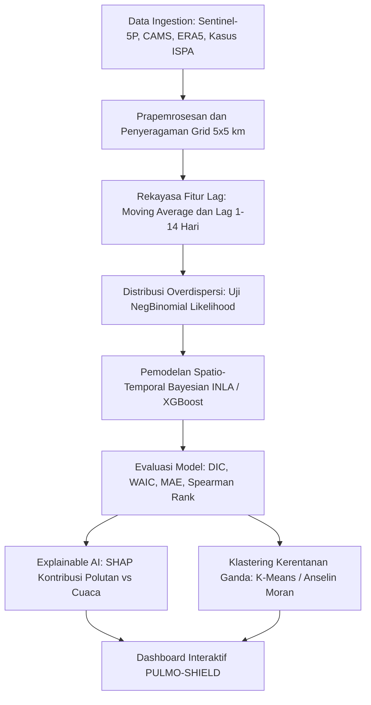

# Rencana Implementasi Topik 2 (Subtema: Kesehatan dan Kesejahteraan Masyarakat)

## 🫁 PULMO-SHIELD: Pemodelan Spatio-Temporal Bayesian dan Machine Learning untuk Proyeksi Beban Kasus ISPA Akut Akibat Paparan Partikulat Halus Multi-Sumber dan Zonasi Intervensi Rendah Emisi di Wilayah Aglomerasi Perkotaan

---

### 1. Metadata & Identitas Karya
* **Subtema Terpilih (Tunggal)**: **Kesehatan dan Kesejahteraan Masyarakat**
* **Keterkaitan Tema ASEC 2026**: Mengintegrasikan data polusi atmosfer satelit dan reanalisis cuaca yang terfragmentasi (*fragmented realities*) menjadi estimasi proyeksi risiko kesehatan pernapasan yang presisi (*clarity*) dalam menghadapi krisis polusi udara perkotaan (*global volatility*).
* **Keterkaitan SDGs**:
  * **SDG 3 (Good Health and Well-Being)** – Target 3.9: Mengurangi secara signifikan jumlah kematian dan kesakitan akibat paparan bahan kimia berbahaya, pencemaran udara, dan kontaminasi lingkungan.
  * **SDG 11 (Sustainable Cities and Communities)** – Target 11.6: Mengurangi dampak lingkungan perkotaan per kapita yang merugikan, termasuk dengan memberi perhatian khusus pada kualitas udara perkotaan.
* **Wilayah Studi / Lokasi Fokus**: Kawasan Aglomerasi Metropolitan Indonesia (Jabodetabek atau Gerbangkertosusila / Surabaya Raya) pada tingkat grid spasial 5 km $\times$ 5 km dan agregasi kabupaten/kota mingguan.

---

### 2. Urgensi Masalah (Why This Matters Now - 2025/2026)
1. **Krisis Polusi Udara Kronis di Perkotaan**: Kawasan aglomerasi metropolitan Indonesia kerap menduduki peringkat kualitas udara terburuk di Asia Tenggara dengan konsentrasi $PM_{2.5}$ harian melampaui standar pedoman WHO hingga 5–10 kali lipat.
2. **Ledakan Beban Morbiditas ISPA**: Penyakit Infeksi Saluran Pernapasan Akut (ISPA) dan pneumonia terus menjadi penyakit nomor satu pada anak-anak/balita dan lansia, menyedot ratusan miliar rupiah beban klaim BPJS Kesehatan setiap tahunnya.
3. **Keterbatasan dan Disparitas Sensor SPKU Darat**: Stasiun Pemantau Kualitas Udara (SPKU) milik pemerintah sangat minim, terkonsentrasi hanya di titik pusat kota tertentu, sering mengalami *downtime*, dan tidak merepresentasikan paparan riil masyarakat di wilayah suburban dan perbatasan industri.
4. **Adanya Efek Tunda Paparan (Lag Effect)**: Dampak polusi udara terhadap lonjakan kunjungan faskes tidak terjadi seketika di hari yang sama, melainkan memiliki jeda waktu (*distributed lag* 3 hingga 14 hari). Tanpa pemodelan efek tunda dan proyeksi beban kasus berbasis data spasial-temporal, fasilitas kesehatan sering kewalahan menerima lonjakan pasien tanpa persiapan logistik obat dan oksigen.

---

### 3. Data Open Source & Tautan Sumber

| No | Nama Data / Indikator | Peran / Variabel | Platform / Sumber | Resolusi / Format | Tautan Sumber Data Terbuka |
| :---: | :--- | :--- | :--- | :--- | :--- |
| 1 | **Sentinel-5P TROPOMI** | Konsentrasi Troposferik $NO_2, SO_2$, & UV Aerosol Index | Copernicus Data Space Ecosystem / GEE | 3.5 km $\times$ 5.5 km, Harian | https://dataspace.copernicus.eu & https://developers.google.com/earth-engine/datasets/catalog/COPERNICUS_S5P_NRTI_L3_NO2 |
| 2 | **CAMS Global Atmospheric Reanalysis** | Konsentrasi Partikulat $PM_{2.5}$ & $PM_{10}$ | Copernicus Atmosphere Monitoring Service | 0.75° (~80 km) / CAMS regional models | https://ads.atmosphere.copernicus.eu/cdsapp#!/dataset/cams-global-reanalysis-eac4 |
| 3 | **ERA5-Land & ERA5 Atmosphere** | Suhu 2m, Kelembapan Relatif, Angin, & *Boundary Layer Height* (BLH) | ECMWF Copernicus Climate Data Store | 0.1° (~9 km), Harian | https://cds.climate.copernicus.eu/datasets/reanalysis-era5-land |
| 4 | **Data Insidensi ISPA & Pneumonia** | Variabel Target ($Y$) Beban Kasus Kesehatan | Dinas Kesehatan Provinsi / Profil Kesehatan Kemenkes / BPS | Tabel Agregat Kasus Mingguan/Bulanan per Kab/Kota | https://satusehat.kemkes.go.id & https://www.bps.go.id |
| 5 | **WorldPop Gridded Population** | Kepadatan Kelompok Rentan (Balita & Lansia) | WorldPop Open Spatial Demographic Data | 100 m $\times$ 100 m GeoTIFF | https://www.worldpop.org/project/categories?id=3 |
| 6 | **OpenStreetMap (OSM) Road & Industrial Network** | Densitas Jaringan Jalan Raya & Zona Industri | Geofabrik / OpenStreetMap | Vektor Spasial Shapefile / GeoJSON | https://download.geofabrik.de/asia/indonesia.html |
| 7 | **Batas Administrasi Indonesia** | Batas Wilayah Kabupaten/Kota & Kecamatan | GADM version 4.1 | Shapefile / GeoJSON | https://gadm.org/download_country.html |

---

### 4. Metodologi Analisis Statistik



#### Tahap 1: Prapemrosesan & Harmonisasi Spasio-Temporal
1. **Grid Indeks Spasial**: Mengagregasikan seluruh variabel konsentrasi polutan atmosfer dan meteorologi ke dalam grid reguler berukuran $5\text{ km} \times 5\text{ km}$ di wilayah aglomerasi studi.
2. **Koreksi Meteorologis**: Mengintegrasikan *Boundary Layer Height* (BLH) dari ERA5 untuk menangkap efek perangkap polutan akibat inversi suhu di lapisan batas atmosfer.

#### Tahap 2: Rekayasa Fitur Lag & Dinamika Temporal
1. **Fitur Lag Waktu**: Membentuk variabel lag paparan $t-1, t-3, t-7$, hingga $t-14$ hari untuk mengukur akumulasi racun partikulat dalam saluran pernapasan.
2. **Rolling Statistics**: Rata-rata bergerak 7-harian konsentrasi $PM_{2.5}$ dan $NO_2$ untuk merefleksikan paparan kronis jangka pendek.

#### Tahap 3: Pemodelan Spatio-Temporal Bayesian (INLA) & Machine Learning
* **Karakteristik Data Kasus**: Data jumlah kunjungan ISPA bersifat cacahan (*count data*) dengan variansi yang jauh lebih besar daripada rata-ratanya (*overdispersion* ekstrem).
* **Struktur Bayesian Hierarchical**:
  $$Y_{it} \sim \text{Negative Binomial}(\mu_{it}, \theta)$$
  $$\log(\mu_{it}) = \beta_0 + \sum_{k} f(X_{kit}) + u_i + v_i + \gamma_t$$
  * $f(X_{kit})$: Efek non-linear konsentrasi polutan dan meteorologi.
  * $u_i + v_i$: Efek spasial terstruktur dan tidak terstruktur (BYM2 model).
  * $\gamma_t$: Efek acak temporal (Random Walk orde-1 atau autoregresif).
* **Alternatif Benchmark**: *XGBoost with Tweedie/Poisson Objective* untuk membandingkan akurasi estimasi titik dan kecepatan komputasi.

#### Tahap 4: Klastering Tipologi "Kerentanan Ganda" & SHAP
1. **Analisis SHAP**: Mengukur magnitudo dampak marginal tiap polutan terhadap peningkatan risiko kasus ISPA.
2. **K-Means / Bivariate Spatial Clustering**: Membagi wilayah ke dalam 4 tipologi kuadran:
   * *Kuadran I (Prioritas Kritis)*: Paparan polusi tinggi $\times$ Kepadatan balita tinggi & kapasitas faskes rendah.
   * *Kuadran II*: Paparan polusi tinggi $\times$ Kapasitas faskes memadai.
   * *Kuadran III*: Paparan polusi rendah $\times$ Kapasitas faskes rendah.
   * *Kuadran IV*: Paparan polusi rendah $\times$ Kapasitas faskes tinggi.

---

### 5. Luaran Produk & Solusi Inovatif

#### A. Sistem Pendukung Keputusan: Dashboard "PULMO-SHIELD"
Aplikasi dashboard analitik berbasis Streamlit / R Shiny:
1. **Halaman Proyeksi Risiko & Early Warning Faskes**:
   * Menampilkan ramalan lonjakan kasus ISPA 7–14 hari ke depan per kabupaten/kota lengkap dengan interval kredibel 95%.
   * Rekomendasi otomatis alokasi obat pernapasan (nebulizer, bronkodilator, oksigen) ke Puskesmas prioritas.
2. **Halaman Peta Zonasi Intervensi Rendah Emisi (LEZ - Low Emission Zone)**:
   * Menampilkan peta *hotspot* polutan real-time dan rekomendasi aktivasi *dynamic policy* (misal: rekomendasi WFH dinamis atau pembatasan truk logistik pada hari-hari dengan prediksi inversi atmosfer parah).
3. **Fitur School Air Quality Alert**:
   * Panduan keselamatan aktivitas luar ruangan bagi sekolah di wilayah berisiko tinggi.

---

### 6. Outline Lengkap Esai (Struktur Sesuai Panduan ASEC, Estimasi 2.500 Kata)

```text
COVER (Sesuai Template Resmi ARSEN 2026)
TABEL LINK SUMBER DATA TERBUKA (Open Source Data Transparency)

1. PENDAHULUAN (~550 kata)
   1.1 Latar Belakang
       - Krisis pencemaran udara perkotaan di Indonesia dan ancaman volatilitas kualitas hidup.
       - Profil beban morbiditas ISPA dan beban fiskal jaminan kesehatan nasional (BPJS).
   1.2 Identifikasi Masalah & Urgensi
       - Keterbatasan stasiun darat SPKU dan blindspot data paparan penduduk suburban.
       - Kompleksitas efek tunda (lag effect) paparan polutan yang belum terakomodasi dalam manajemen faskes.
   1.3 Keterkaitan Subtema & SDGs
       - Penegasan subtema: Kesehatan dan Kesejahteraan Masyarakat.
       - Korelasi langsung dengan SDG 3 (Good Health and Well-Being - Target 3.9) dan SDG 11 (Target 11.6).

2. PEMBAHASAN (~1.600 kata)
   2.1 Tinjauan Pustaka
       - Toksikologi partikulat PM2.5, NO2, dan mekanisme patologis infeksi pernapasan akut.
       - Teori pemodelan spatio-temporal Bayesian untuk analisis data kesehatan lingkungan.
   2.2 Metodologi Analisis
       - Integrasi data Sentinel-5P, CAMS, ERA5-Land, dan penyeragaman grid spasio-temporal.
       - Rekayasa variabel distributed lag dan formulasi Negative Binomial Bayesian INLA.
       - Metrik validasi statistik (DIC, WAIC, MAE, Spearman rank) dan teknik interpretasi SHAP.
       - Metode klastering K-Means untuk identifikasi tipologi kerentanan wilayah ganda.
   2.3 Hasil dan Pembahasan
       - Dinamika spasio-temporal konsentrasi PM2.5 dan anomali meteorologi inversi suhu.
       - Evaluasi performa model prediktif dan signifikansi efek lag waktu paparan (3-14 hari).
       - Analisis SHAP: Mengurai kontribusi partikulat versus kelembapan/suhu udara.
       - Peta tipologi kerentanan ganda dan identifikasi kabupaten/kota prioritas darurat kesehatan.
   2.4 Solusi Inovatif: Dashboard Interaktif PULMO-SHIELD
       - Arsitektur sistem peringatan dini faskes dan zonasi kebijakan rendah emisi adaptif.
       - Simulasi skenario penurunan emisi terhadap penghematan beban pembiayaan kesehatan.

3. PENUTUP (~350 kata)
   3.1 Kesimpulan
       - Sintesis hasil pemodelan, efektivitas integrasi data satelit, dan kuadran wilayah paling rentan.
   3.2 Saran & Rekomendasi Kebijakan
       - Rekomendasi implementatif bagi Kementerian Kesehatan, Kementerian LHK, dan Pemerintah Daerah.
       - Arah riset lanjutan (pemodelan mobilitas penduduk dengan GPS trace data).

DAFTAR PUSTAKA (Format APA 7th Edition, 2021-2026)
LAMPIRAN (Peta sebaran polutan, tabel evaluasi model, grafik SHAP summary, dan tangkapan layar dashboard)
```

---

### 7. Keunggulan Kompetitif di Mata Juri ASEC
1. **Kedalaman Teori Statistika**: Pemodelan Bayesian INLA dengan *Negative Binomial Likelihood* dan *Distributed Lag* adalah metode statistik tingkat tinggi yang sangat dihargai oleh dosen/juri Departemen Statistika UNAIR.
2. **Dampak Sosial-Kemanusiaan Nyata**: Solusi langsung menjawab beban kesehatan riil anak-anak dan masyarakat perkotaan.
