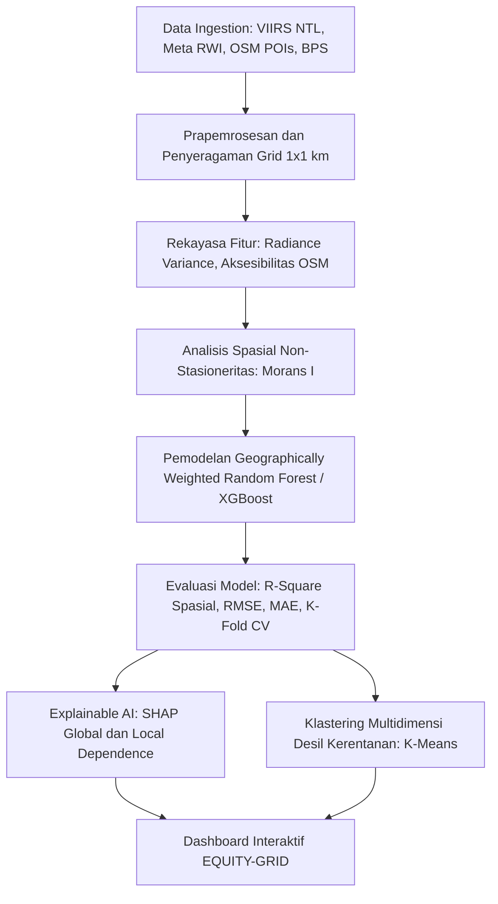

# Rencana Implementasi Topik 3 (Subtema: Sosial Ekonomi)

## 📊 EQUITY-GRID: Integrasi Citra Satelit Nighttime Light dan Spatial Machine Learning untuk Estimasi Mikro Kerentanan Ekonomi Rumah Tangga dan Optimasi Jaring Pengaman Sosial Dinamis di Indonesia

---

### 1. Metadata & Identitas Karya
* **Subtema Terpilih (Tunggal)**: **Sosial Ekonomi**
* **Keterkaitan Tema ASEC 2026**: Mengintegrasikan data penginderaan jauh aktivitas ekonomi malam hari dan kepadatan infrastruktur terbuka yang terfragmentasi (*fragmented realities*) menjadi estimasi mikro kerentanan ekonomi yang transparan dan objektif (*clarity*) guna menavigasi volatilitas daya beli dan inflasi pangan (*global volatility*).
* **Keterkaitan SDGs**:
  * **SDG 10 (Reduced Inequalities)** – Target 10.1: Mencapai pertumbuhan pendapatan 40% populasi terbawah secara berkelanjutan; Target 10.2: Memberdayakan dan mendorong inklusi sosial, ekonomi, dan politik bagi semua.
  * **SDG 1 (No Poverty)** – Target 1.3: Menerapkan sistem perlindungan sosial yang tepat secara nasional dan mencapai cakupan substansial bagi kaum miskin dan rentan.
* **Wilayah Studi / Lokasi Fokus**: Wilayah Aglomerasi Perkotaan dan Kantong Pedesaan (Provinsi Jawa Timur atau skala Nasional multi-provinsi) pada level grid mikro $1\text{ km} \times 1\text{ km}$ dan agregasi kecamatan.

---

### 2. Urgensi Masalah (Why This Matters Now - 2025/2026)
1. **Volatilitas Harga & Disrupsi Ketenagakerjaan**: Kenaikan harga kebutuhan pokok, volatilitas harga beras, serta gelombang pergeseran tenaga kerja formal ke sektor informal (*gig economy*, kurir, buruh harian lepas) menyebabkan jutaan keluarga berada di ambang rentan miskin (*near-poor*).
2. **Kelemahan Survei Konvensional (Time-Lag Data Susenas)**: Data kemiskinan resmi BPS (Susenas) dirilis dengan jeda waktu (*time-lag*) tahunan dan hanya merepresentasikan sampel agregat tingkat kabupaten/kota. Data ini tidak mampu mendeteksi kantong-kantong kemiskinan mikro di tingkat kelurahan/desa atau lingkungan permukiman padat.
3. **Tingginya Exclusion & Inclusion Error Bansos**: Penyaluran bantuan sosial (seperti PKH, BPNT, BLT) sering mengalami salah sasaran (*exclusion error*: warga miskin tidak terdaftar; *inclusion error*: warga mampu terdaftar) akibat pemutakhiran data registrasi sosial ekonomi (DTKS/Regsosek) yang lambat dan rentan bias subjektivitas lapangan.
4. **Peluang Big Data Satelit Nighttime Light (NTL)**: Intensitas pencahayaan malam hari (NTL) berkorelasi sangat kuat dengan konsumsi listrik, aktivitas komersial, dan akumulasi aset rumah tangga. Menggabungkan NTL dengan data mobilitas dan fasilitas infrastruktur terbuka (OpenStreetMap) memungkinkan pendugaan tingkat kesejahteraan mikro secara objektif, murah, dan *near-real-time*.

---

### 3. Data Open Source & Tautan Sumber

| No | Nama Data / Indikator | Peran / Variabel | Platform / Sumber | Resolusi / Format | Tautan Sumber Data Terbuka |
| :---: | :--- | :--- | :--- | :--- | :--- |
| 1 | **VIIRS Nighttime Day/Night Band (DNB)** | Intensitas Radiansi Cahaya Malam (Proksi Aktivitas Ekonomi) | NOAA Earth Observation Group (EOG) / Earthdata | 15 arc-second (~500 m), Komposit Bulanan/Tahunan | https://eogdata.mines.edu/products/vnl/ & https://developers.google.com/earth-engine/datasets/catalog/NOAA_VIIRS_DNB_MONTHLY_V1_VCMCFG |
| 2 | **Meta Relative Wealth Index (RWI)** | Indeks Kekayaan Relatif Mikro (Aset Rumah Tangga) | Meta Data for Good / Humanitarian Data Exchange (HDX) | 2.4 km grid GeoTIFF / CSV | https://dataforgood.facebook.com/dfg/tools/relative-wealth-index |
| 3 | **Meta High Resolution Population Density** | Kepadatan Penduduk & Distribusi Rumah Tangga | Meta Data for Good / CIESIN Columbia Univ | 30 m GeoTIFF | https://dataforgood.facebook.com/dfg/tools/high-resolution-population-density-maps |
| 4 | **OpenStreetMap (OSM) Infrastructure POIs** | Aksesibilitas Pasar, Sekolah, Faskes, & Jalan | Geofabrik / Overpass API | Vektor Spasial Shapefile / GeoJSON | https://download.geofabrik.de/asia/indonesia.html |
| 5 | **Data BPS Susenas & Podes** | Garis Kemiskinan, Persentase Penduduk Miskin, & Indeks Keparahan | Badan Pusat Statistik (BPS) Indonesia | Tabel Publikasi Agregat Kab/Kota | https://www.bps.go.id |
| 6 | **Batas Administrasi Indonesia** | Batas Administrasi Provinsi, Kabupaten, & Kecamatan | GADM version 4.1 | Shapefile / GeoJSON | https://gadm.org/download_country.html |

---

### 4. Metodologi Analisis Statistik



#### Tahap 1: Prapemrosesan & Penyeragaman Grid Mikro
1. **Grid Indeks Spasial**: Membentuk grid reguler $1\text{ km} \times 1\text{ km}$ di seluruh wilayah analisis.
2. **Koreksi Cahaya Satelit**: Menghapus efek pantulan awan, *stray light*, dan efek saturasi cahaya di pusat kota pada data VIIRS NTL.
3. **Ekstraksi Aksesibilitas OSM**: Menghitung jarak euclidean dan kerapatan fasilitas dasar per grid (jarak ke jalan utama, jumlah pasar tradisional dalam radius 3 km, faskes tingkat pertama, dan bank/ATM).

#### Tahap 2: Rekayasa Fitur & Indikator Komposit
1. **Rasio Cahaya per Kapita**:
   $$\text{LPC}_{i} = \frac{\text{Radiance}_{i}}{\log(1 + \text{Populasi}_{i})}$$
2. **Indeks Aksesibilitas Infrastruktur (IAI)**: Komposit jarak berbobot terhadap layanan dasar perbankan, pasar, dan transportasi.

#### Tahap 3: Pemodelan Spatial Machine Learning
* **Tantangan Metodologis**: Adanya efek autokorelasi spasial dan non-stasioneritas (hubungan antara cahaya malam dan tingkat kemiskinan di Jawa berbeda dengan di luar Jawa).
* **Algoritma Utama**:
  1. *Geographically Weighted Random Forest (GWRF)*: Memadukan kekuatan *Random Forest* menangkap hubungan non-linear dengan pembobotan spasial lokal (matriks jarak Gaussian kernel).
  2. *Extreme Gradient Boosting (XGBoost)*: Sebagai baseline komparatif nasional.
* **Target Output**: Estimasi probabilitas rumah tangga berada pada Desil 1–3 (kelompok termiskin dan rentan guncangan) pada resolusi mikro 1 km.

#### Tahap 4: Klastering Desil & Pengukuran Ketimpangan Spasial
1. **Spatial Gini & Theil Decomposition**: Mengukur proporsi ketimpangan yang disumbang oleh perbedaan antarkabupaten versus perbedaan internal di dalam kabupaten (*within-district inequality*).
2. **Analisis SHAP**: Mengurai faktor pendorong utama kerentanan di tiap klaster (apakah isolasi geografis/minimnya akses pasar atau stagnasi daya beli listrik/cahaya).

---

### 5. Luaran Produk & Solusi Inovatif

#### A. Sistem Pendukung Keputusan: Dashboard "EQUITY-GRID"
Dashboard analitik geospasial berbasis Streamlit / Dash:
1. **Halaman Peta Mikro-Targeting Kerentanan Ekonomi**:
   * Memetakan kantong kemiskinan hingga tingkat grid 1 km (zoomable interaktif) lengkap dengan perkiraan jumlah populasi Desil 1–3.
   * Fitur filter berdasarkan tingkat aksesibilitas infrastruktur dan status penerimaan bantuan.
2. **Modul Validasi & Audit Bansos (Anti-Error Exclusion)**:
   * Menampilkan titik anomali (*mismatch* antara data penerima bansos eksisting dengan intensitas radiansi riil satelit).
3. **Simulasi Dampak Guncangan Ekonomi (Shock-Responsive Simulation)**:
   * Mensimulasikan dampak lonjakan inflasi pangan terhadap perluasan kantong kemiskinan baru.

---

### 6. Outline Lengkap Esai (Struktur Sesuai Panduan ASEC, Estimasi 2.500 Kata)

```text
COVER (Sesuai Template Resmi ARSEN 2026)
TABEL LINK SUMBER DATA TERBUKA (Open Source Data Transparency)

1. PENDAHULUAN (~550 kata)
   1.1 Latar Belakang
       - Volatilitas ekonomi global, tekanan inflasi domestik, dan fenomena pelemahan daya beli kelas menengah bawah.
       - Disparitas regional dan tantangan target pengentasan kemiskinan ekstrem Indonesia Emas 2045.
   1.2 Identifikasi Masalah & Urgensi
       - Keterbatasan survei Susenas konvensional (time-lag, resolusi makro kasar, biaya survei mahal).
       - Permasalahan sistemik exclusion dan inclusion error dalam penetapan sasaran perlindungan sosial.
   1.3 Keterkaitan Subtema & SDGs
       - Penegasan subtema: Sosial Ekonomi.
       - Korelasi langsung dengan SDG 10 (Reduced Inequalities - Target 10.1 & 10.2) dan SDG 1 (No Poverty - Target 1.3).

2. PEMBAHASAN (~1.600 kata)
   2.1 Tinjauan Pustaka
       - Teori ekonomi spasial, nighttime light sebagai proksi aktivitas ekonomi mikro, dan konsep multidimensional poverty.
       - Perkembangan Geographically Weighted Machine Learning untuk estimasi indikator sosial-ekonomi.
   2.2 Metodologi Analisis
       - Integrasi data VIIRS NTL, Meta RWI, OpenStreetMap, dan penyeragaman grid mikro 1 km.
       - Formulasi model Geographically Weighted Random Forest (GWRF) dan penanganan non-stasioneritas spasial.
       - Matriks evaluasi model (Spatial R-squared, RMSE, MAE) dan interpretasi TreeSHAP.
       - Formulasi dekomposisi Indeks Theil dan klastering kerentanan spasial.
   2.3 Hasil dan Pembahasan
       - Sebaran spasial intensitas radiansi NTL dan aksesibilitas fasilitas dasar di wilayah studi.
       - Perbandingan kinerja model spasial vs non-spasial (Tabel evaluasi akurasi).
       - Analisis SHAP: Kontribusi relatif infrastruktur jalan, pasar, dan konsumsi listrik malam hari terhadap kekayaan rumah tangga.
       - Peta mikro kerentanan ekonomi dan dekomposisi disparitas wilayah intra-kabupaten.
   2.4 Solusi Inovatif: Implementasi Dashboard EQUITY-GRID
       - Arsitektur sistem mikro-targeting jaring pengaman sosial adaptif bagi Bappenas dan Kemensos.
       - Protokol audit data bansos berbasis verifikasi citra satelit untuk meminimalkan salah sasaran.

3. PENUTUP (~350 kata)
   3.1 Kesimpulan
       - Sintesis hasil pemodelan mikro kerentanan, efektivitas integrasi Big Data NTL, dan kantong ketimpangan utama.
   3.2 Saran & Rekomendasi Kebijakan
       - Rekomendasi implementatif integrasi EQUITY-GRID ke dalam pemutakhiran Registrasi Sosial Ekonomi (Regsosek).
       - Arah riset lanjutan (pemanfaatan data transaksi digital teragregasi).

DAFTAR PUSTAKA (Format APA 7th Edition, 2021-2026)
LAMPIRAN (Peta mikro grid kerentanan, tabel perbandingan desil, matriks evaluasi GWRF, tampilan dashboard)
```

---

### 7. Keunggulan Kompetitif di Mata Juri ASEC
1. **Sangat Pas dengan Narasi Guidebook ASEC**: Guidebook ASEC secara eksplisit menggarisbawahi pentingnya isu sosial-ekonomi, ketimpangan wilayah, dan pencapaian SDG 10 & 11.
2. **Metodologi Modern yang Jarang Dipakai Mahasiswa**: Penerapan *Geographically Weighted Random Forest (GWRF)* dengan data satelit malam hari VIIRS dan Meta RWI menunjukkan penguasaan data sains spasial mutakhir yang pasti diapresiasi juri statistika.
