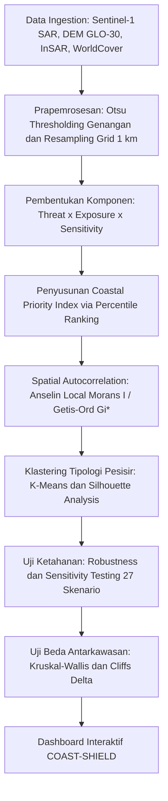

# Rencana Implementasi Topik 4 (Subtema: Lingkungan)

## 🌊 COAST-SHIELD: Sistem Pendukung Keputusan Spasial Berbasis Multi-Sensor SAR dan Multi-Criteria Priority Indexing untuk Penilaian Kerentanan dan Zonasi Restorasi Pesisir Akibat Kombinasi Land Subsidence dan Banjir Rob

---

### 1. Metadata & Identitas Karya
* **Subtema Terpilih (Tunggal)**: **Lingkungan**
* **Keterkaitan Tema ASEC 2026**: Mengintegrasikan data radar satelit multi-sensor, model elevasi digital, dan dinamika tutupan lahan pesisir yang terfragmentasi (*fragmented realities*) menjadi sistem penentuan prioritas restorasi pesisir yang terukur dan objektif (*clarity*) dalam menghadapi krisis kenaikan air laut dan degradasi pantai (*global volatility*).
* **Keterkaitan SDGs**:
  * **SDG 13 (Climate Action)** – Target 13.1: Memperkuat kapasitas adaptasi dan ketahanan terhadap bahaya yang berkaitan dengan iklim dan bencana alam di semua negara.
  * **SDG 14 (Life Below Water)** – Target 14.2: Mengelola dan melindungi ekosistem laut dan pesisir secara berkelanjutan guna menghindari dampak merugikan yang signifikan, termasuk memperkuat ketahanannya.
* **Wilayah Studi / Lokasi Fokus**: Koridor Pesisir Kritis Pantura Jawa (Pekalongan, Semarang, Demak, hingga Pesisir Surabaya–Gresik) pada level grid spasial $500\text{ m} \times 500\text{ m}$ atau $1\text{ km} \times 1\text{ km}$.

---

### 2. Urgensi Masalah (Why This Matters Now - 2025/2026)
1. **Ancaman "Kota Tenggelam" Akibat Land Subsidence**: Kawasan pesisir dataran rendah Indonesia, khususnya sepanjang pantai utara (Pantura) Jawa, mengalami laju penurunan muka tanah (*land subsidence*) yang mengkhawatirkan (mencapai 5 hingga 15 cm per tahun) akibat masifnya penyedotan air tanah untuk industri dan pembebanan struktur bangunan.
2. **Amplifikasi oleh Kenaikan Air Laut & Rob Permanen**: Kombinasi amblesan tanah dengan kenaikan muka air laut global memicu banjir pasang surut (rob) yang kini tidak lagi bersifat musiman, melainkan telah menjadi genangan permanen yang menenggelamkan ribuan hektare tambak, persawahan pesisir, dan ribuan rumah warga.
3. **Kegagalan Paradigma "Hard Engineering" Tunggal**: Pembangunan tanggul laut beton konvensional terbukti menelan biaya triliunan rupiah namun sering amblas bersama penurunan tanah, retak, atau jebol terhantam abrasi gelombang tinggi.
4. **Kebutuhan Prioritisasi Restorasi Nature-based Solutions (NbS)**: Penyelamatan pesisir memerlukan transisi ke infrastruktur hijau (restorasi sabuk hijau mangrove dan zona retensi banjir). Namun, dengan keterbatasan anggaran APBN/APBD, pemerintah membutuhkan sistem pendukung keputusan objektif untuk menentukan titik grid mana yang harus diprioritaskan pertama kali untuk intervensi vegetasi vs relokasi warga.

---

### 3. Data Open Source & Tautan Sumber

| No | Nama Data / Indikator | Peran / Variabel | Platform / Sumber | Resolusi / Format | Tautan Sumber Data Terbuka |
| :---: | :--- | :--- | :--- | :--- | :--- |
| 1 | **Sentinel-1 SAR GRD (IW)** | Pemetaan Genangan Air Rob Multi-Temporal (Polarisasi VV & VH) | Copernicus Data Space Ecosystem / GEE | 10 m, Resolusi 12-Harian | https://dataspace.copernicus.eu & https://developers.google.com/earth-engine/datasets/catalog/COPERNICUS_S1_GRD |
| 2 | **Copernicus DEM GLO-30** | Elevasi Mikro & Kemiringan Lereng Pesisir (Slope) | Copernicus Open Access Hub / AWS Registry | 30 m GeoTIFF | https://registry.opendata.aws/copernicus-dem/ |
| 3 | **Data Laju Amblesan Tanah (InSAR / Geodesi)** | Laju Subsiden Pesisir Tahunan (cm/tahun) | Publikasi Terbuka Badan Riset dan Inovasi Nasional (BRIN) / BIG | Gridded CSV / GeoTIFF | https://geoportal.big.go.id & https://data.brin.go.id |
| 4 | **ESA WorldCover 2021/2022** | Tutupan Lahan Mangrove, Tambak, Permukiman, & Badan Air | ESA WorldCover Project / GEE | 10 m GeoTIFF | https://esa-worldcover.org/en |
| 5 | **WorldPop High Resolution Population** | Jumlah Penduduk Pesisir Terdampak | WorldPop Demographic Data | 100 m GeoTIFF | https://www.worldpop.org |
| 6 | **Batas Administrasi Indonesia** | Batas Wilayah Kabupaten & Pesisir 12 Mil Laut | GADM version 4.1 / KKP Geoportal | Shapefile / GeoJSON | https://gadm.org & https://geoportal.kkp.go.id |

---

### 4. Metodologi Analisis Statistik



#### Tahap 1: Prapemrosesan & Pemetaan Genangan Satelit Radar
1. **Otsu Automatic Thresholding**: Mengolah citra multi-temporal Sentinel-1 SAR untuk memisahkan secara otomatis area genangan banjir rob dari daratan kering sepanjang periode 2023–2025.
2. **Penyeragaman Grid Pesisir**: Seluruh dataset diseragamkan ke dalam grid reguler $1\text{ km} \times 1\text{ km}$ pada zona penyangga (*buffer*) pantai 0–10 km ke daratan.

#### Tahap 2: Formulasi Coastal Priority Index (CPI)
Mengadopsi kerangka multi-kriteria spasial non-linear:
$$Priority_{i,\text{raw}} = \text{percentile}(Threat_i) \times \text{percentile}(Exposure_i) \times \text{percentile}(Sensitivity_i)$$
* **Threat ($T$)**: Laju penurunan muka tanah InSAR (cm/th) + Frekuensi genangan rob Sentinel-1.
* **Exposure ($E$)**: Populasi pesisir terdampak + Luas area permukiman/tambak pada elevasi $< 2$ meter DPL.
* **Sensitivity / Degradation ($S$)**: Rasio hilangnya tutupan mangrove terhadap garis pantai.
* Normalisasi Min-Max diterapkan untuk menghasilkan skor akhir $CPI_i \in [0, 1]$.

#### Tahap 3: Uji Statistik Spasial & Tipologi Wilayah
1. **Anselin Local Moran's I**: Mendeteksi klaster *High-High* (wilayah dengan ancaman dan kerentanan kritis yang mengelompok secara spasial).
2. **K-Means Clustering**: Menentukan tipologi wilayah pesisir berdasarkan profil komponen (misal: klaster *"Amblesan Ekstrem & Padat Permukiman"*, *"Abrasi Tinggi & Tambak Terancam"*, *"Zona Penyangga Stabil"*).
3. **Silhouette Analysis**: Memilih jumlah klaster optimal $k$ secara objektif.

#### Tahap 4: Uji Ketahanan (Sensitivity Analysis) & Uji Non-Parametrik
1. **Uji Sensitivitas 27 Skenario**: Menguji stabilitas peringkat prioritas antar-grid jika bobot $T, E,$ dan $S$ divariasikan secara ekstrem menggunakan korelasi rank Spearman.
2. **Uji Kruskal-Wallis & Cliff's $\delta$**: Membuktikan secara statistik perbedaan signifikan tingkat urgensi antar-koridor pesisir Pantura Jawa dengan *effect size* yang terukur.

---

### 5. Luaran Produk & Solusi Inovatif

#### A. Sistem Pendukung Keputusan: Dashboard "COAST-SHIELD"
Dashboard interaktif berbasis Streamlit:
1. **Halaman Peta Zonasi Intervensi Pesisir**:
   * *Zona Konservasi Sabuk Hijau (Green Belt)*: Grid yang direkomendasikan untuk restorasi mangrove masif guna mereduksi energi gelombang rob.
   * *Zona Retensi Air Pasang (Polder Alami)*: Grid bekas tambak terlantar yang dikonversi menjadi kolam retensi rob.
   * *Zona Pembatasan Ketat Air Tanah*: Wilayah dengan laju amblesan $>10$ cm/th yang wajib moratorium sumur industri.
2. **Modul Simulasi Kenaikan Rob 2026–2035**:
   * Menampilkan proyeksi garis pantai baru jika tanpa intervensi vs jika sabuk mangrove terestorasi.
3. **Kalkulator Biaya-Manfaat (Cost-Benefit Ratio)**:
   * Menghitung penghematan biaya mitigasi jika menggunakan pendekatan *Nature-based Solutions* (NbS) dibandingkan terus-menerus meninggikan tanggul beton.

---

### 6. Outline Lengkap Esai (Struktur Sesuai Panduan ASEC, Estimasi 2.500 Kata)

```text
COVER (Sesuai Template Resmi ARSEN 2026)
TABEL LINK SUMBER DATA TERBUKA (Open Source Data Transparency)

1. PENDAHULUAN (~550 kata)
   1.1 Latar Belakang
       - Krisis perubahan iklim global, sea level rise, dan ancaman nyata tenggelamnya pesisir Indonesia.
       - Fenomena amblesan tanah (land subsidence) ekstrem di koridor pantai utara Jawa.
   1.2 Identifikasi Masalah & Urgensi
       - Keterbatasan pendekatan tanggul beton keras (hard seawall) yang tidak berkelanjutan dan mahal.
       - Ketiadaan instrumen penentuan prioritas berbasis data terintegrasi untuk alokasi dana restorasi pesisir.
   1.3 Keterkaitan Subtema & SDGs
       - Penegasan subtema: Lingkungan.
       - Korelasi langsung dengan SDG 13 (Climate Action - Target 13.1) dan SDG 14 (Life Below Water - Target 14.2).

2. PEMBAHASAN (~1.600 kata)
   2.1 Tinjauan Pustaka
       - Teori geomorfologi pesisir, dinamika land subsidence, dan peran hidrologis ekosistem mangrove.
       - Prinsip Multi-Criteria Spatial Decision Analysis dalam perencanaan tata ruang pesisir adaptif.
   2.2 Metodologi Analisis
       - Prapemrosesan citra Sentinel-1 SAR (Otsu thresholding), DEM GLO-30, dan penyeragaman grid 1 km.
       - Formulasi Coastal Priority Index (komponen Threat, Exposure, dan Sensitivity).
       - Metode spasial Anselin Local Moran's I dan evaluasi klaster K-Means via Silhouette score.
       - Uji ketahanan sensitivitas multi-skenario pembobotan dan uji komparasi Kruskal-Wallis.
   2.3 Hasil dan Pembahasan
       - Peta frekuensi genangan rob historis dan sebaran spasial laju penurunan muka tanah.
       - Distribusi nilai Coastal Priority Index dan identifikasi klaster spasial High-High di Pantura Jawa.
       - Karakteristik 4 tipologi wilayah pesisir hasil K-Means dan profil intervensi yang dibutuhkan.
       - Hasil uji sensitivitas: Bukti stabilitas peringkat prioritas antar-grid di berbagai skenario pembobotan.
   2.4 Solusi Inovatif: Dashboard Interaktif COAST-SHIELD
       - Arsitektur sistem pendukung keputusan untuk Kementerian Kelautan & Perikanan, KLHK, dan Pemda Pesisir.
       - Strategi pembagian zona: Sabuk hijau mangrove, polder retensi rob, dan zona moratorium air tanah.

3. PENUTUP (~350 kata)
   3.1 Kesimpulan
       - Sintesis hasil pemetaan kerentanan pesisir, koridor paling kritis, dan validitas indeks komposit.
   3.2 Saran & Rekomendasi Kebijakan
       - Rekomendasi regulasi pengetatan izin air tanah industri dan alokasi anggaran APBN untuk Nature-based Solutions.
       - Arah pengembangan riset lanjutan (penggunaan data InSAR resolusi tinggi TerraSAR-X).

DAFTAR PUSTAKA (Format APA 7th Edition, 2021-2026)
LAMPIRAN (Peta per komponen indeks, tabel uji Kruskal-Wallis & Cliff's delta, matriks sensitivitas 27 skenario, visual dashboard)
```

---

### 7. Keunggulan Kompetitif di Mata Juri ASEC
1. **Mengadopsi Pola Metodologi Juara (*Winning Recipe*)**: Struktur pemodelan indeks berbasis persentil dengan uji *Kruskal-Wallis, Cliff's delta*, dan *27-scenario sensitivity test* ini persis seperti formula sukses yang membawa *Coraly* juara 1 di kompetisi SMATIC UGM.
2. **Visual Spasial yang Sangat Memukau**: Peta kombinasi data elevasi, radar satelit genangan air rob, dan amblesan tanah menghasilkan visualisasi tematik tingkat tinggi yang sangat meyakinkan bagi juri.
