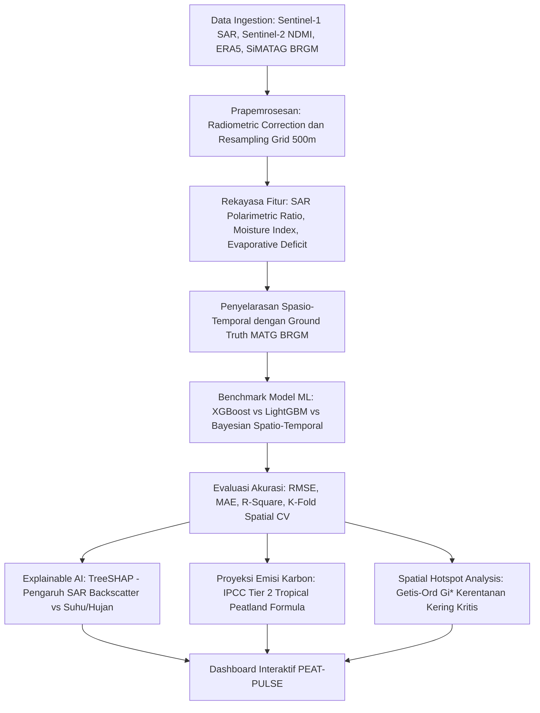

# Rencana Implementasi Topik 5 (Subtema: Lingkungan)

## 🌿 PEAT-PULSE: Sistem Pendukung Keputusan Spatio-Temporal Berbasis Multi-Sensor Satelit dan Machine Learning untuk Estimasi Penurunan Muka Air Tanah Gambut, Proyeksi Emisi Karbon, dan Zonasi Restorasi Hidrologis Menuju FOLU Net Sink 2030 di Indonesia

---

### 1. Metadata & Identitas Karya
* **Subtema Terpilih (Tunggal)**: **Lingkungan**
* **Keterkaitan Tema ASEC 2026**: Mentransformasi data radar mikrogelombang satelit, indeks kelembapan vegetasi, dan reanalisis hidroklimatologi yang tersebar (*fragmented realities*) menjadi estimasi kedalaman muka air tanah gambut dan proyeksi emisi karbon yang akurat (*clarity*) dalam rangka menavigasi volatilitas iklim global (*global volatility*).
* **Keterkaitan SDGs**:
  * **SDG 13 (Climate Action)** – Target 13.2: Mengintegrasikan langkah-langkah antisipasi perubahan iklim ke dalam kebijakan, strategi, dan perencanaan nasional (khususnya pencapaian target komitmen iklim *Indonesia FOLU Net Sink 2030*).
  * **SDG 15 (Life on Land)** – Target 15.1: Menjamin pelestarian, restorasi, dan pemanfaatan berkelanjutan ekosistem daratan dan lahan basah pedalaman (*wetlands* / gambut).
* **Wilayah Studi / Lokasi Fokus**: Kesatuan Hidrologis Gambut (KHG) Kritis Nasional di Provinsi Riau, Sumatera Selatan, atau Kalimantan Tengah (pada resolusi grid spasial $500\text{ m} \times 500\text{ m}$ atau $1\text{ km} \times 1\text{ km}$ temporal 12-harian/bulanan).

---

### 2. Urgensi Masalah (Why This Matters Now - 2025/2026)
1. **Lahan Gambut Indonesia Sebagai "Kubah Karbon" Global**: Indonesia memiliki ekosistem lahan gambut tropis terluas di dunia (~13,4 juta hektare) yang menyimpan cadangan karbon raksasa hingga $\approx 57\text{ Gt}$ karbon. Namun, pembukaan kanal drainase liar untuk perkebunan kelapa sawit dan HTI telah mengeringkan kubah gambut secara masif.
2. **Krisis Emisi Dekomposisi & Risiko Kebakaran Bawah Permukaan**: Saat muka air tanah gambut (MATG) turun melebihi ambang batas kritis regulasi PP No. 57/2016 (yaitu $>0,4\text{ meter}$ di bawah permukaan tanah), gambut mengering, mengalami oksidasi biologis cepat yang melepaskan ratusan juta ton emisi $CO_2$ ke atmosfer per tahun, serta sangat rentan terbakar menjadi karhutla bawah tanah (*smoldering fires*) yang mustahil dipadamkan saat kemarau.
3. **Komitmen Nasional Indonesia FOLU Net Sink 2030**: Pemerintah telah menetapkan target ambisius agar sektor kehutanan dan penggunaan lahan lainnya (*Forestry and Other Land Uses / FOLU*) mencapai penyerapan karbon bersih (*net sink*) pada tahun 2030. Restorasi hidrologis gambut adalah pilar nomor satu untuk mencapai target ini.
4. **Keterbatasan Sensor Pemantau Darat (SiMATAG-0.4m)**: Badan Restorasi Gambut dan Mangrove (BRGM) telah memasang stasiun pemantau otomatis, namun jumlahnya sangat sedikit ($<1.000$ titik sensor) untuk mengawasi jutaan hektare rimba gambut yang terisolasi. Banyak sensor mengalami *downtime*, rusak terkena petir/korosi, atau dirusak pihak tidak bertanggung jawab. Diperlukan pendekatan estimasi proaktif berbasis satelit penginderaan jauh (*remote sensing*) dan pemodelan statistik spasial untuk memetakan dinamika air gambut secara kontinu di seluruh KHG.

---

### 3. Data Open Source & Tautan Sumber

| No | Nama Data / Indikator | Peran / Variabel | Platform / Sumber | Resolusi / Format | Tautan Sumber Data Terbuka |
| :---: | :--- | :--- | :--- | :--- | :--- |
| 1 | **Sentinel-1 SAR GRD (C-Band)** | Backscatter Ko-Polarisasi (VV) & Silang (VH) untuk deteksi kelembapan dielektrik tanah gambut | Copernicus Data Space Ecosystem / GEE | 10 m, komposit 12-harian | https://dataspace.copernicus.eu & https://developers.google.com/earth-engine/datasets/catalog/COPERNICUS_S1_GRD |
| 2 | **Sentinel-2 MSI Level-2A** | Normalized Difference Moisture Index (NDMI) & Normalized Burn Ratio (NBR) | ESA Copernicus / GEE | 10–20 m, 5-harian | https://developers.google.com/earth-engine/datasets/catalog/COPERNICUS_S2_SR_HARMONIZED |
| 3 | **ERA5-Land Reanalysis** | Presipitasi Harian, Suhu Permukaan Tanah, & Evapotranspirasi Aktual | ECMWF Copernicus Climate Data Store | 0.1° (~9 km), Harian | https://cds.climate.copernicus.eu/datasets/reanalysis-era5-land |
| 4 | **Peta Kesatuan Hidrologis Gambut (KHG)** | Batas Ekologis Kubah Gambut & Zonasi Fungsi Lindung/Budidaya | Kementerian Lingkungan Hidup dan Kehutanan (KLHK) | Vektor Poligon Shapefile | https://sigap.menlhk.go.id |
| 5 | **Data Stasiun Pemantauan MATG (SiMATAG-0.4m)** | Data Observasi Lapangan Muka Air Tanah Gambut ($Y$ Ground Truth) | Badan Restorasi Gambut dan Mangrove (BRGM) | Data Deret Waktu CSV / Portal SiMATAG | https://simatag04.brgm.go.id |
| 6 | **Peta Kedalaman Gambut Indonesia** | Variabel Kontrol Tebal Lapisan Gambut (0–50 cm hingga $>300$ cm) | Balai Besar Litbang Sumberdaya Lahan Pertanian (BBSDLP) / Geoportal Pertanian | Peta Tematik Skala 1:50.000 GeoTIFF/Shapefile | https://balittanah.pertanian.go.id & https://geoportal.kemenkeu.go.id |
| 7 | **Batas Administrasi Indonesia** | Batas Administrasi Kabupaten/Kecamatan | GADM version 4.1 | Shapefile / GeoJSON | https://gadm.org/download_country.html |

---

### 4. Metodologi Analisis Statistik



#### Tahap 1: Prapemrosesan & Penyeragaman Grid Geospasial
1. **Prapemrosesan Radar Sentinel-1**: *Thermal noise removal*, kalibrasi radiometrik ($\sigma^0$), dan koreksi medan (*Range-Doppler Terrain Correction*) menggunakan DEM. Rasio silang polarisasi ($\sigma^0_{VH} / \sigma^0_{VV}$) dihitung untuk mengisolasi sinyal kelembapan tanah dari gangguan tutupan tajuk kanopi hutan.
2. **Harmonisasi Grid**: Mengintegrasikan seluruh citra satelit dan data iklim ke dalam unit grid reguler berukuran $500\text{ m} \times 500\text{ m}$ pada Kesatuan Hidrologis Gambut studi.
3. **Penyelarasan Stasiun SiMATAG**: Titik stasiun darat BRGM diekstrak nilai koordinat dan tanggal observasinya untuk disandingkan dengan nilai piksel citra pada jendela waktu yang sama sebagai data latih (*training set*).

#### Tahap 2: Rekayasa Fitur Multidimensi
1. **Normalized Difference Moisture Index (NDMI)**:
   $$NDMI = \frac{\rho_{NIR} - \rho_{SWIR1}}{\rho_{NIR} + \rho_{SWIR1}}$$
2. **Indeks Defisit Hidrologis (HDI)**:
   $$HDI_t = \sum_{k=0}^{14} (P_{t-k} - PET_{t-k})$$
   Mengukur akumulasi neraca air (curah hujan dikurangi evapotranspirasi potensial) selama 14 hari ke belakang.
3. **Kombinasi Sinyal Radar**: Log-rasio intensitas polarisasi $(\log_{10}(\sigma^0_{VV}) - \log_{10}(\sigma^0_{VH}))$.

#### Tahap 3: Pemodelan Machine Learning & Spatio-Temporal
* **Target Variabel ($Y$)**: Kedalaman Muka Air Tanah Gambut kontinu (dalam satuan meter di bawah permukaan, nilai negatif menandakan berada di bawah muka tanah).
* **Algoritma Benchmark**:
  1. *Extreme Gradient Boosting (XGBoost Regressor)*: Menangkap relasi non-linear antara kelembapan dielektrik radar dan kedalaman air tanah.
  2. *LightGBM*: Penanganan cepat untuk data spasio-temporal berskala besar.
  3. *Bayesian Hierarchical Spatial Model (INLA)*: Mengestimasi ketidakpastian posterior estimasi MATG pada wilayah pedalaman tanpa stasiun pemantau darat.
* **Validasi**: *Spatial Block Cross-Validation* untuk menguji akurasi model ketika memprediksi kubah gambut yang belum pernah dipasang sensor sama sekali (*zero-shot spatial prediction*).

#### Tahap 4: Proyeksi Emisi Karbon & Uji Spasial
1. **Formula Proyeksi Emisi Karbon (IPCC Tier 2 for Tropical Peatlands)**:
   $$\text{Emisi } CO_2\text{ (ton } CO_2\text{-eq/ha/th)} = \beta \times |\text{MATG}| + \epsilon$$
   Di mana setiap penurunan 10 cm MATG di bawah permukaan diasosiasikan dengan emisi rata-rata sekitar $9,1\text{ ton } CO_2\text{-eq/ha/tahun}$ akibat dekomposisi aerobik materi organik gambut.
2. **Explainable AI (TreeSHAP)**: Menjelaskan variabel mana yang paling berkontribusi pada penurunan drastis air tanah (apakah defisit hujan berkepanjangan atau anomali temperatur permukaan tanah LST).
3. **Getis-Ord $G_i^*$ Spatial Hotspot**: Memetakan klaster kubah gambut berisiko kekeringan ekstrem ($MATG < -0,4\text{ m}$) yang teridentifikasi secara statistik signifikan ($p < 0,01$) sebagai target intervensi darurat.

---

### 5. Luaran Produk & Solusi Inovatif

#### A. Sistem Pendukung Keputusan: Dashboard "PEAT-PULSE"
Aplikasi dashboard geospasial interaktif berbasis Streamlit:
1. **Halaman Pemantauan Dinamis Muka Air Gambut (Dynamic WTD Monitor)**:
   * Peta interaktif estimasi MATG per grid 500 m dengan sistem kode warna lampu lalu lintas (*Hijau: Aman $\ge -0,2\text{ m}$; Kuning: Waspada $-0,2 \text{ s.d. } -0,4\text{ m}$; Merah: Krisis $<-0,4\text{ m}$*).
   * Grafik deret waktu riwayat dan tren penurunan air tanah per Kesatuan Hidrologis Gambut (KHG).
2. **Kalkulator Emisi Karbon Real-Time Menuju FOLU Net Sink 2030**:
   * Menghitung total emisi harian/bulanan yang terlepas akibat kekeringan gambut di wilayah konsesi maupun hutan lindung, serta memproyeksikan potensi reduksi emisi jika air berhasil dinaikkan ke level aman.
3. **Modul Rekomendasi Restorasi Hidrologis (Canal Blocking Optimizer)**:
   * Menentukan titik koordinat paling strategis untuk pembangunan sekat kanal (*canal blocking*) baru atau penutupan pintu air agar genangan air gambut kembali terjaga (*rewetting* adaptif).
4. **Modul Pengawasan Konsesi (Regulatory Compliance Audit)**:
   * Mendeteksi kepatuhan batas muka air tanah pada areal konsesi korporasi (sawit/HTI) sebagai dasar pengenaan sanksi lingkungan atau insentif kredit karbon.

---

### 6. Outline Lengkap Esai (Struktur Sesuai Panduan ASEC, Estimasi 2.500 Kata)

```text
COVER (Sesuai Template Resmi ARSEN 2026)
TABEL LINK SUMBER DATA TERBUKA (Open Source Data Transparency)

1. PENDAHULUAN (~550 kata)
   1.1 Latar Belakang
       - Posisi ekologis lahan gambut tropis Indonesia sebagai cadangan karbon global dan penyangga biosfer.
       - Komitmen nasional Indonesia FOLU Net Sink 2030 dan tantangan krisis emisi akibat kanalisasi gambut.
   1.2 Identifikasi Masalah & Urgensi
       - Keterbatasan stasiun pemantau darat SiMATAG BRGM (biaya tinggi, coverage terbatas, risiko kerusakan alat).
       - Ketiadaan sistem terintegrasi yang mampu memproyeksikan dinamika air tanah dan fluks emisi secara near-real-time.
   1.3 Keterkaitan Subtema & SDGs
       - Penegasan subtema tunggal: Lingkungan.
       - Korelasi langsung dengan SDG 13 (Climate Action - Target 13.2) dan SDG 15 (Life on Land - Target 15.1).

2. PEMBAHASAN (~1.600 kata)
   2.1 Tinjauan Pustaka
       - Teori hidrologi gambut, dinamika dielektrik radar SAR C-Band, dan proses oksidasi biokimia bahan organik.
       - Perkembangan pemodelan Machine Learning dalam estimasi bio-geofisika lahan basah.
   2.2 Metodologi Analisis
       - Prapemrosesan radar Sentinel-1 SAR (koreksi radiometrik & terrain) dan indeks spektral Sentinel-2 NDMI.
       - Penyelarasan spatio-temporal dengan observasi stasiun darat SiMATAG-0.4m BRGM.
       - Formulasi algoritma XGBoost Regressor dan skema validasi Spatial Block Cross-Validation.
       - Formulasi emisi karbon IPCC Tier 2, analisis interpretabilitas TreeSHAP, dan Getis-Ord Gi* hotspot.
   2.3 Hasil dan Pembahasan
       - Korelasi antara koefisien hamburan balik SAR dengan fluktuasi muka air tanah gambut historis.
       - Evaluasi akurasi model prediktif (RMSE, MAE, R² pada data uji out-of-sample).
       - Analisis TreeSHAP: Mengidentifikasi signifikansi relatif radar backscatter versus defisit presipitasi ERA5.
       - Peta sebaran spasial MATG, estimasi kehilangan karbon per KHG, dan deteksi klaster hotspot krisis kekeringan.
   2.4 Solusi Inovatif: Implementasi Dashboard PEAT-PULSE
       - Arsitektur sistem pemantauan dinamis dan fitur kalkulator emisi karbon bagi BRGM dan Kementerian LHK.
       - Algoritma rekomendasi titik pembangunan sekat kanal (canal blocking) untuk efisiensi anggaran restorasi.

3. PENUTUP (~350 kata)
   3.1 Kesimpulan
       - Ringkasan keandalan integrasi satelit radar dan machine learning dalam memetakan muka air gambut tanpa sensor darat.
       - Kontribusi nyata sistem PEAT-PULSE dalam mengawal target emisi FOLU Net Sink 2030.
   3.2 Saran & Rekomendasi Kebijakan
       - Rekomendasi operasional bagi BRGM dan Ditjen PPKL KLHK dalam audit tata kelola air konsesi.
       - Arah riset lanjutan (integrasi citra SAR polarimetrik L-Band NISAR untuk penetrasi kanopi tebal).

DAFTAR PUSTAKA (Format APA 7th Edition, 2021-2026)
LAMPIRAN (Peta sebaran kedalaman gambut, grafik validasi model vs observasi SiMATAG, plot SHAP, dan tangkapan layar dashboard)
```

---

### 7. Keunggulan Kompetitif di Mata Juri ASEC
1. **Isu Lingkungan Paling Bergengsi Secara Internasional**: Isu gambut tropis dan emisi karbon adalah topik ilmiah teratas di forum iklim PBB (COP) dan kebijakan transisi hijau Indonesia.
2. **Kombinasi Sains Tingkat Tinggi (Remote Sensing + Machine Learning + IPCC Carbon Formula)**: Menghubungkan pantulan mikrogelombang radar satelit dengan model hidrologi dan rumus emisi karbon IPCC merupakan perpaduan sains data dan statistika lingkungan yang sangat elegan, mutakhir, dan berbobot tinggi.
3. **Data Ground Truth Resmi Tersedia**: Data stasiun pemantauan SiMATAG-0.4m milik BRGM dapat diakses dan digunakan sebagai variabel terikat ground truth nyata, memberikan legitimasi empiris yang sangat kuat di hadapan dewan juri.
