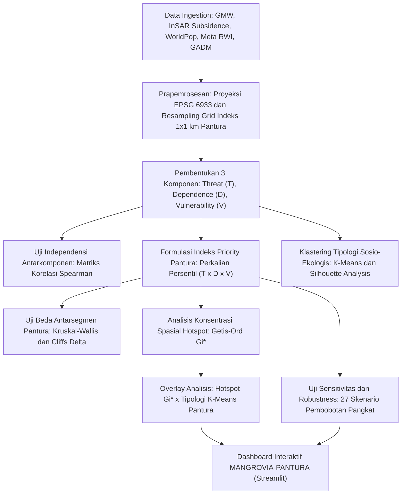

# Rencana Implementasi Topik 6 (Subtema: Lingkungan)

## 🦀 MANGROVIA-PANTURA: Sistem Pendukung Keputusan Berbasis Indeks Prioritas Sosio-Ekologis untuk Konservasi dan Restorasi Hutan Mangrove di Koridor Pesisir Kritis Pantai Utara Jawa

---

### 1. Metadata & Identitas Karya
* **Subtema Terpilih (Tunggal)**: **Lingkungan**
* **Keterkaitan Tema ASEC 2026**: Mentransformasi data penginderaan jauh tutupan mangrove, dinamika penurunan tanah (*land subsidence*), kerapatan populasi pesisir, dan proksi ekonomi mikro yang terfragmentasi (*fragmented realities*) menjadi kejelasan penentuan zonasi prioritas restorasi mangrove (*clarity*) guna menavigasi volatilitas krisis ekologis pesisir (*global volatility*).
* **Keterkaitan SDGs**:
  * **SDG 14 (Life Below Water)** – Target 14.2: Mengelola dan melindungi ekosistem laut dan pesisir secara berkelanjutan untuk menghindari dampak buruk abrasi dan degradasi laut.
  * **SDG 13 (Climate Action)** – Target 13.1 & 13.2: Memperkuat kapasitas adaptasi terhadap bencana iklim (banjir rob ekstrem) melalui infrastruktur alami berbasis vegetasi pantai (*Nature-based Solutions*).
  * **SDG 1 (No Poverty)** – Target 1.5: Membangun ketahanan masyarakat nelayan pesisir miskin dan rentan dari kehilangan mata pencaharian akibat kerusakan pesisir.
* **Wilayah Studi Komparatif**: Tiga Segmen Koridor Sosio-Ekologis Pantai Utara (Pantura) Jawa:
  1. *Segmen Pantura Barat (Aglomerasi Industri & Urban)*: Pesisir Muara Gembong (Bekasi), Karawang, dan Subang (tekanan konversi industri & sedimentasi muara).
  2. *Segmen Pantura Tengah (Zona Krisis Subsidensi & Abrasi Ekstrem)*: Pesisir Pekalongan, Batang, Semarang, dan Demak (khususnya kawasan Sayung yang mengalami laju amblesan tanah $>10\text{ cm/tahun}$ dan rob permanen).
  3. *Segmen Pantura Timur (Zona Tambak Tradisional & Delta Semiarid)*: Pesisir Jepara, Rembang, Tuban, Lamongan, hingga Ujung Pangkah Gresik & Surabaya (tekanan silvofishery, sedimentasi DAS Bengawan Solo, dan kepadatan nelayan tradisional).

---

### 2. Urgensi Masalah (Why This Matters Now - 2025/2026)
1. **Krisis "Tenggelamnya" Koridor Pantai Utara Jawa**: Pantai Utara (Pantura) Jawa sepanjang $>1.000\text{ km}$ dihuni oleh lebih dari 50 juta jiwa dan merupakan urat nadi ekonomi nasional. Namun, Pantura kini menjadi episentrum bencana pesisir paling parah di Indonesia akibat kombinasi mematikan antara **kenaikan air laut**, **penurunan muka tanah (*land subsidence*) hingga 10–15 cm/th**, dan **hilangnya $>70\%$ sabuk hijau mangrove alami** akibat alih fungsi tambak intensif dan industri sejak dekade 1980-an.
2. **Fenomena "Drowned Mangroves" dan Kematian Ekosistem**: Akibat penurunan tanah yang masif, sisa-sisa petak mangrove di Pantura Tengah (Demak dan Pekalongan) mengalami genangan air pasang permanen di luar batas toleransi pasang surutnya (*hypoxia/anoxia* pada pneumatofor akar), menyebabkan pohon mangrove mati berdiri, garis pantai mundur ratusan meter, dan ribuan rumah warga tenggelam menjadi lautan.
3. **Kelemahan Penentuan Prioritas Konvensional**: Program rehabilitasi mangrove pemerintah selama ini (BRGM dan KLHK) kerap **hanya berpatokan pada kondisi biofisik kanopi eksisting** (Peta Mangrove Nasional: lebat/sedang/jarang). Pendekatan ini mengabaikan dimensi manusia:
   * Seberapa besar masyarakat setempat bergantung (*Dependence*) pada mangrove sebagai benteng peredam abrasi permukiman dan habitat kepiting/udang bakau?
   * Seberapa rentan kondisi ekonomi (*Vulnerability*) nelayan pesisir yang terancam kehilangan tempat tinggal?
4. **Prinsip Keadilan Restorasi Sosio-Ekologis**: Petak mangrove di Pantura Tengah dengan ancaman abrasi ekstrem dan masyarakat miskin yang terancam tenggelam memiliki **urgensi intervensi darurat yang jauh lebih tinggi** dibandingkan petak mangrove di dekat kawasan pelabuhan komersial yang memiliki kapasitas finansial adaptasi mandiri.
5. **Kebutuhan Sistem Pendukung Keputusan Terpadu**: Diperlukan sistem pendukung keputusan (*Decision Support System*) berbasis data spasial terbuka pada grid mikro $1\text{ km} \times 1\text{ km}$ yang mampu mengidentifikasi titik mana di Pantura yang paling mendesak untuk dialokasikan bibit restorasi sabuk hijau (*green belt*) dan pemecah ombak alami.

---

### 3. Data Open Source & Tautan Sumber

| No | Nama Data / Indikator | Komponen Indeks | Platform / Sumber | Resolusi / Format | Tautan Sumber Data Terbuka |
| :---: | :--- | :--- | :--- | :--- | :--- |
| 1 | **Global Mangrove Watch (GMW v3/v4)** | **Threat ($T$)** & **Dependence ($D$)** (Luas Mangrove & Deforestasi 2015–2024) | Aberystwyth Univ / Wetlands International / JAXA | 25 m Vektor Poligon & Raster GeoTIFF | https://www.globalmangrovewatch.org & https://data.unep-wcmc.org/datasets/45 |
| 2 | **Data Laju Penurunan Tanah (InSAR / Geodesi)** | **Threat ($T$)** (Laju Amblesan Tanah Pesisir Pantura dalam cm/tahun) | Publikasi Geodesi Geospasial BRIN & Badan Informasi Geospasial (BIG) | Gridded Data / CSV Spasial | https://geoportal.big.go.id & https://data.brin.go.id |
| 3 | **Sentinel-1 SAR GRD (IW)** | **Threat ($T$)** (Frekuensi Inundasi Genangan Banjir Rob Musiman) | Copernicus Data Space Ecosystem / GEE | 10 m, Komposit 12-Harian | https://developers.google.com/earth-engine/datasets/catalog/COPERNICUS_S1_GRD |
| 4 | **WorldPop High Resolution Population** | **Dependence ($D$)** (Populasi Nelayan & Warga Pesisir Radius 5 km) | WorldPop Open Demographic Data | 100 m GeoTIFF | https://www.worldpop.org/project/categories?id=3 |
| 5 | **Meta Relative Wealth Index (RWI)** | **Vulnerability ($V$)** (Proksi Kemiskinan & Aset Rumah Tangga Pesisir) | Meta Data for Good / Humanitarian Data Exchange (HDX) | 2.4 km Gridded CSV / GeoTIFF | https://dataforgood.facebook.com/dfg/tools/relative-wealth-index |
| 6 | **Copernicus DEM GLO-30** | **Karakteristik Biofisik** (Elevasi Mikro Pesisir dan Kemiringan Lereng Pantai) | AWS Open Data Registry / Copernicus | 30 m GeoTIFF | https://registry.opendata.aws/copernicus-dem/ |
| 7 | **Batas Administrasi Pesisir Jawa** | **Batas Wilayah Studi** (Batas Kabupaten Pantura Jawa & Garis Pantai) | GADM version 4.1 & BIG | Shapefile / GeoJSON | https://gadm.org/download_country.html |

---

### 4. Metodologi Analisis Statistik (Kerangka Kerja 1-to-1 Coraly)



#### Tahap 1: Prapemrosesan & Harmonisasi Spasial Pantura (Grid $1\text{ km} \times 1\text{ km}$)
1. **Batas Unit Analisis**: Wilayah pesisir sepanjang pantai utara Pulau Jawa dari Banten/Jakarta hingga Selat Madura/Jawa Timur, dibatasi pada zona daratan dan perairan pesisir $\le 12$ mil laut (UU No. 23/2014).
2. **Proyeksi Equal-Area**: Seluruh dataset diseragamkan ke dalam grid reguler berukuran $1\text{ km} \times 1\text{ km}$ menggunakan proyeksi setara silindris (EPSG:6933) untuk mencegah distorsi luasan antarwilayah.

#### Tahap 2: Pembentukan Tiga Komponen Indeks Prioritas
1. **Threat ($T$) - Tekanan Biofisik Pesisir Pantura**:
   * Komposit dari laju penurunan tanah tahunan (*land subsidence rate* InSAR, hingga $>10\text{ cm/th}$ di Demak/Pekalongan) + frekuensi genangan rob Sentinel-1 SAR + laju deforestasi kanopi mangrove historis (GMW 2015–2024).
   * Nilai dinormalisasi min-max ke skala $[0, 1]$.
2. **Dependence ($D$) - Ketergantungan Nelayan & Komunitas Pesisir**:
   * Mengadopsi formula bio-demografis non-linear Coraly:
     $$D_{\text{raw}} = \text{mangrove}_R \times \log(1 + \text{pop}_R)$$
     * $\text{mangrove}_R$: Luas tutupan mangrove ($\text{km}^2$) di dalam grid indeks.
     * $\text{pop}_R$: Jumlah penduduk dalam radius 5 km dari pusat grid (WorldPop).
     * *Rasionalisasi*: Transformasi logaritma meredam ledakan jumlah penduduk Pantura yang sangat padat, sementara perkalian memastikan skor ketergantungan hanya tinggi bila terdapat hutan mangrove dan permukiman warga secara bersamaan.
3. **Vulnerability ($V$) - Kerentanan Sosial-Ekonomi Warga Pesisir**:
   * Diperoleh dari rata-rata nilai Relative Wealth Index (RWI) Meta dalam radius 2,5 km dari pusat grid.
   * Nilai RWI kemudian **dibalik nilainya (dikalikan $-1$)**, sehingga nilai yang semakin tinggi merepresentasikan kantong kemiskinan dan ketiadaan aset ekonomi keluarga pesisir.

#### Tahap 3: Formulasi Indeks Priority Pantura
Nilai mentah $T, D,$ dan $V$ dari seluruh segmen Pantura digabung, lalu diperingkat secara persentil:
$$P_{i,\text{raw}} = \text{percentile}(T_i) \times \text{percentile}(D_i) \times \text{percentile}(V_i)$$
Normalisasi Min-Max diterapkan untuk menghasilkan skor akhir $P_i \in [0, 1]$:
$$P_i = \frac{P_{i,\text{raw}} - P_{\text{raw},\min}}{P_{\text{raw},\max} - P_{\text{raw},\min}}$$
* *Prinsip*: Peringkat prioritas tinggi hanya akan terjadi jika suatu titik mengalami ancaman amblesan/abrasi parah, memiliki populasi yang bergantung pada mangrove, dan masyarakatnya miskin/rentan.

#### Tahap 4: Uji Independensi & Uji Komparatif Antarsegmen
1. **Uji Matriks Korelasi**: Membuktikan bahwa $T, D,$ dan $V$ tidak berkorelasi linier (korelasi $|r| < 0,2$), membuktikan bahwa ketiga komponen mengukur dimensi krisis yang berbeda.
2. **Uji Kruskal-Wallis & Cliff's $\delta$**: Menguji signifikansi perbedaan antara Pantura Barat, Pantura Tengah, dan Pantura Timur. Efek autokorelasi spasial diatasi dengan berfokus pada ukuran efek (*effect size*) $\epsilon^2$ dan Cliff's $\delta$ untuk mengukur magnitudo disparitas antarsegmen.

#### Tahap 5: Konsentrasi Spasial Hotspot (Getis-Ord $G_i^*$)
Menghitung statistik spasial **Getis-Ord $G_i^*$** dengan pita ketetanggaan 3 km untuk memisahkan klaster konsentrasi prioritas tinggi (*hotspot*) yang mengelompok di sepanjang garis pantai Pantura dari zona berkonsentrasi rendah (*coldspot*).

#### Tahap 6: Tipologi Sosio-Ekologis (K-Means & Silhouette Analysis)
1. Menentukan klaster optimal $k$ berbasis **Silhouette Score** untuk mengelompokkan grid Pantura ke dalam 4 tipologi:
   * **Tipe 1 (Darurat Evakuasi & Sabuk Hijau Kuat)**: *"Amblesan/Terancam Ekstrem, Miskin, Sangat Bergantung"* $\rightarrow$ contoh: Sayung Demak dan pesisir Pekalongan.
   * **Tipe 2 (Zona Industri & Tambak Intensif)**: *"Terancam, Mampu, Kurang Bergantung"* $\rightarrow$ contoh: Pesisir Semarang barat dan Bekasi industri.
   * **Tipe 3 (Zona Konservasi Silvofishery)**: *"Aman Relatif, Mampu, Sangat Bergantung"* $\rightarrow$ contoh: Tambak mangrove Ujung Pangkah Gresik & Jepara.
   * **Tipe 4 (Zona Penyangga Stabil)**: *"Aman Relatif, Miskin, Kurang Bergantung"*.
2. **Overlay Hotspot $\times$ Tipologi**: Mengidentifikasi tipe klaster mana yang mendominasi tiap kantong *hotspot* prioritas di Pantura.

#### Tahap 7: Uji Sensitivitas dan Ketahanan (27 Skenario Pembobotan)
Menguji stabilitas urutan prioritas antar-grid Pantura terhadap **27 skenario kombinasi pangkat bobot**:
$$P_{i,\text{scenario}} = \text{percentile}(T_i)^a \times \text{percentile}(D_i)^b \times \text{percentile}(V_i)^c \quad (a, b, c \in \{0.5, 1.0, 1.5\})$$
Konsistensi dievaluasi menggunakan korelasi rank Spearman. Jika $\ge 70\%$ skenario mempertahankan korelasi $\rho \ge 0,90$, indeks terbukti *robust* terhadap perubahan asumsi teknis.

---

### 5. Luaran Produk: Dashboard Interaktif "MANGROVIA-PANTURA"

Aplikasi Sistem Pendukung Keputusan (*Decision Support System*) berbasis **Streamlit**:
1. **Peta Interaktif Pantura Zoomable Per Grid 1 km**:
   * Menampilkan sebaran skor $P_i$ dari Banten hingga Jawa Timur dengan *slider filter* untuk menyaring kawasan berdasarkan laju amblesan tanah ($T$), jumlah penduduk terdampak ($D$), atau tingkat kemiskinan ($V$).
2. **Katalog Aksi Kebijakan Berbasis Tipologi Klaster**:
   * *Untuk Tipe 1 (Pantura Tengah - Krisis Ekstrem)*: Rekomendasi pembangunan struktur pemecah gelombang semi-permeabel hibrida (APBO dari bambu) untuk menangkap sedimen lumpur, diikuti penanaman bibit mangrove berakar tunjang dalam (*Rhizophora mucronata*), serta alokasi jaring pengaman sosial jaminan relokasi warga.
   * *Untuk Tipe 2 (Pantura Barat - Zona Tambak/Industri)*: Rekomendasi kewajiban sabuk hijau mangrove 30% pada tambak intensif dan moratorium eksploitasi air tanah industri.
   * *Untuk Tipe 3 (Pantura Timur - Tambak Silvofishery)*: Insentif sertifikasi perikanan ramah mangrove dan pengembangan ekowisata mangrove.
3. **Kalkulator Biaya Mitigasi Kerusakan Pesisir**:
   * Menghitung penghematan anggaran perbaikan infrastruktur jalan dan permukiman Pantura jika sabuk hijau mangrove berhasil dipulihkan dibandingkan terus-menerus meninggikan tanggul beton yang amblas.

---

### 6. Outline Lengkap Esai (Sesuai Struktur Resmi ASEC, Estimasi 2.500 Kata)

```text
COVER (Sesuai Template Resmi ARSEN 2026)
TABEL LINK SUMBER DATA TERBUKA (Open Source Data Transparency)

1. PENDAHULUAN (~550 kata)
   1.1 Latar Belakang
       - Posisi strategis dan kerapuhan koridor Pantai Utara (Pantura) Jawa sebagai episentrum demografi dan logistik nasional.
       - Krisis degradasi mangrove Pantura akibat konversi tambak historis dan ancaman abrasi laut.
   1.2 Identifikasi Masalah & Urgensi
       - Kompleksitas interaksi antara laju amblesan tanah (land subsidence), banjir rob permanen, dan tenggelamnya permukiman nelayan.
       - Kelemahan sistemik penentuan prioritas restorasi konvensional yang mengabaikan dimensi kerentanan kemiskinan warga pesisir.
   1.3 Keterkaitan Subtema & SDGs
       - Penegasan subtema tunggal: Lingkungan.
       - Korelasi langsung dengan SDG 14 (Life Below Water - Target 14.2), SDG 13 (Climate Action), dan SDG 1 (No Poverty - Target 1.5).

2. PEMBAHASAN (~1.600 kata)
   2.1 Tinjauan Pustaka
       - Ekologi mangrove pesisir Pantura Jawa, dinamika land subsidence, dan peran hidrologis bio-shield mangrove peredam rob.
       - Teori Spatial Multi-Criteria Decision Analysis dalam perencanaan tata ruang pesisir berkeadilan.
   2.2 Metodologi Analisis
       - Pengumpulan data terbuka (GMW, InSAR BRIN, WorldPop, Meta RWI) dan penyeragaman grid 1 km Pantura (EPSG:6933).
       - Formulasi komponen Threat (T), Dependence (D), Vulnerability (V), dan formula Priority Index via persentil non-linear.
       - Prosedur uji korelasi independensi, uji beda non-parametrik Kruskal-Wallis, dan effect size Cliff's delta antarsegmen.
       - Statistik spasial Getis-Ord Gi*, klastering K-Means Silhouette, dan kerangka uji sensitivitas 27 skenario.
   2.3 Hasil dan Pembahasan
       - Karakteristik sebaran spasial ancaman biofisik, ketergantungan warga, dan kantong kemiskinan di 3 segmen Pantura.
       - Distribusi Indeks Priority Pantura: Menempatkan Pantura Tengah (Demak-Pekalongan) sebagai prioritas tertinggi.
       - Signifikansi uji Kruskal-Wallis dan konfirmasi disparitas ukuran efek Cliff's delta antarsegmen Pantura.
       - Klaster konsentrasi hotspot Getis-Ord Gi* dan dominasi tipologi Tipe 1 (terancam ekstrem, miskin, sangat bergantung).
       - Bukti ketahanan indeks: Stabilitas konsistensi peringkat prioritas pada 27 skenario pembobotan pangkat.
   2.4 Solusi Inovatif: Implementasi Dashboard MANGROVIA-PANTURA
       - Arsitektur sistem pendukung keputusan interaktif berbasis Streamlit bagi pengambil kebijakan pesisir.
       - Rekomendasi intervensi bertarget: Struktur hibrida penangkap lumpur, rehabilitasi silvofishery, dan insentif nelayan.

3. PENUTUP (~350 kata)
   3.1 Kesimpulan
       - Sintesis keunggulan integrasi indikator sosio-ekologis dalam menentukan titik darurat restorasi mangrove Pantura.
       - Bukti kuantitatif bahwa Pantura Tengah memerlukan alokasi anggaran intervensi paling mendesak.
   3.2 Saran & Rekomendasi Kebijakan
       - Rekomendasi operasional bagi Bappenas, BRGM, KKP, dan Pemerintah Provinsi di sepanjang koridor Pantura Jawa.
       - Arah riset lanjutan (pemodelan hidrodinamika gelombang rob lokal beresolusi tinggi).

DAFTAR PUSTAKA (Format APA 7th Edition, 2021-2026)
LAMPIRAN (Tabel uji Kruskal-Wallis antarsegmen Pantura, tabel uji lanjut Dunn & Cliff's delta, matriks 27 skenario sensitivitas, visual dashboard)
```

---

### 7. Keunggulan Kompetitif di Mata Dewan Juri ASEC ARSEN UNAIR:
1. **Relevansi Lokal & Geografis Sangat Kuat**: Universitas Airlangga berlokasi di Jawa Timur, yang merupakan gerbang timur Pantura Jawa. Mengangkat krisis nyata di pekarangan Pulau Jawa (Demak, Pekalongan, hingga pesisir Gresik/Surabaya) memberikan resonansi emosional dan relevansi kebijakan yang luar biasa kuat bagi juri.
2. **Kombinasi Isu Lingkungan Paling Fenomenal**: Menghubungkan mangrove dengan fenomena **tenggelamnya Pantura Jawa akibat *land subsidence*** adalah narasi lingkungan hidup paling dramatis, faktual, dan mendesak di Indonesia saat ini.
3. **Penerapan Metodologi Coraly yang Mulus & Utuh**: Kerangka $T \times D \times V$, *Kruskal-Wallis*, *Cliff's $\delta$*, *Getis-Ord $G_i^*$*, *K-Means*, dan *27-scenario sensitivity test* teraplikasikan secara natural tanpa ada pemaksaan metodologi, menjadikan karya ini sangat kokoh secara saintifik.
