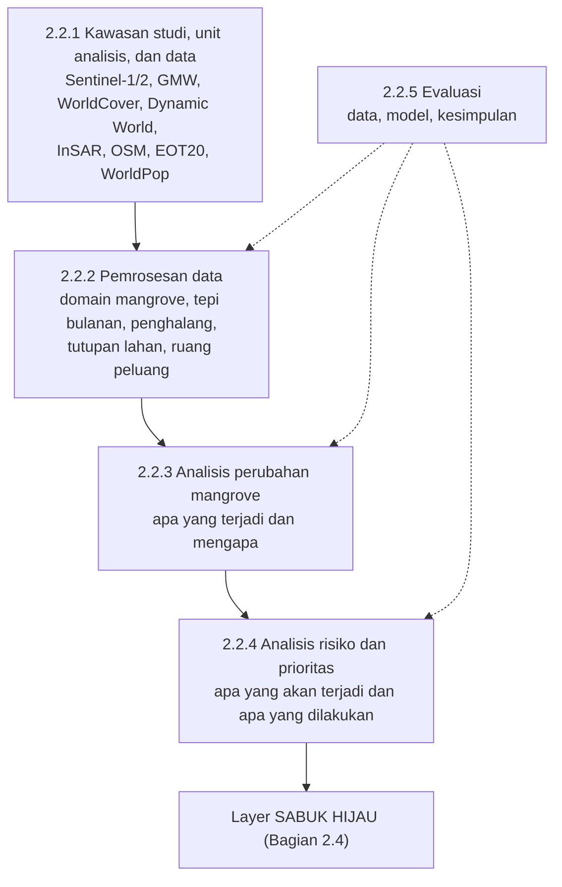

# SABUK HIJAU: Sistem Pendukung Keputusan Berbasis Fusi Data Multi-Sumber dan Pemodelan Probabilistik untuk Prioritas Mitigasi *Coastal Squeeze* Mangrove Pantura

## 1. Pendahuluan

### 1.1 Latar belakang

Mangrove adalah benteng alami pesisir. Tegakan mangrove selebar 100 meter dapat menurunkan tinggi gelombang 13–66%, sekaligus menjadi habitat ikan dan penopang ekonomi masyarakat pesisir (Kementerian Lingkungan Hidup, 2026). Mangrove juga menimbun sedimen di antara akarnya sehingga permukaan tanahnya bisa ikut naik mengikuti muka laut (Lovelock dkk., 2015). Karena itu, keberadaan sabuk mangrove menentukan keselamatan permukiman, tambak, dan infrastruktur di belakangnya.

Indonesia memiliki ekosistem mangrove terluas di dunia, sekitar 22,6% dari luas mangrove global (Giri dkk., 2011). Menurut Peta Mangrove Nasional 2021, luasnya mencapai 3.364.080 hektare (Violleta, 2021). Namun, luasan itu adalah sisa dari kehilangan besar selama beberapa dekade terakhir. Menurut Global Mangrove Watch (2026), Indonesia termasuk lima negara dengan perubahan bersih luas mangrove terbesar di dunia pada tiga periode pengamatan. Sepanjang 1985–2025, luas mangrove Indonesia berkurang bersih 2.043,72 km². Pada 2000–2025, penurunannya 1.071,65 km². Sebaliknya, pada 2015–2025 luasnya bertambah bersih 469,95 km². Artinya, kehilangan besar terjadi sebelum 2015 dan baru berbalik menjadi pertambahan dalam satu dekade terakhir. Kehilangan itu terutama didorong oleh konversi menjadi tambak (Ilman dkk., 2016). Pemerintah merespons dengan program rehabilitasi berskala besar, termasuk target percepatan rehabilitasi 600 ribu hektare di sembilan provinsi (Violleta, 2021).

Pantai utara Jawa (Pantura) adalah wilayah tempat ancaman terhadap mangrove paling berlapis. BRIN mencatat 65,8% garis pantai dari Serang hingga Situbondo mengalami erosi. Sebanyak 84% pantainya tersusun dari endapan aluvial dan delta yang belum padat, dan sekitar 83% wilayahnya berada kurang dari 10 meter di atas muka laut (Putri, 2026). Tanah di sejumlah titik turun hingga 16 cm/tahun di Demak, 14 cm/tahun di Sidoarjo, dan 11 cm/tahun di Pekalongan (Putri, 2026). Pemetaan InSAR seluruh Pulau Jawa menegaskan bahwa amblesan terkuat terpusat di pesisir utara (Ohenhen dkk., 2026). Laju ini puluhan kali lebih cepat daripada kenaikan muka laut Laut Jawa sebesar 0,39 cm/tahun (Kismawardhani dkk., 2018). Kajian atas 44 studi menunjukkan bahwa degradasi mangrove Pantura digerakkan oleh ekspansi tambak, reklamasi, pembangunan kota dan industri, serta lemahnya tata kelola (Muryani dkk., 2026). Tekanan konversi pun belum berhenti. Pada 2025, 20.413 hektare kawasan hutan di empat kabupaten pesisir Jawa Barat ditetapkan untuk revitalisasi tambak, 16.078 hektare di antaranya hutan lindung (Bhawono, 2025).

Gabungan kedua tekanan ini disebut ***coastal squeeze*** (himpitan pesisir). Dari sisi laut, amblesan dan kenaikan muka laut menenggelamkan lahan lebih cepat daripada kemampuan mangrove menimbun sedimen. Dari sisi darat, tambak berpematang, permukiman, jalan, dan tanggul menutup ruang ke mana mangrove seharusnya bisa bermigrasi. Bila akresi kalah cepat dan migrasi ke darat terhalang, sabuk mangrove menyempit lalu hilang (Saintilan dkk., 2020). Di Demak, kenaikan muka laut relatif sudah mencapai empat kali laju akresi mangrove (van Bijsterveldt dkk., 2023).

### 1.2 Permasalahan

Keberhasilan rehabilitasi selama ini umumnya diukur dari luas tanam atau luas tutupan. Ukuran itu bisa menyesatkan di Pantura. Data Global Mangrove Watch yang kami olah menunjukkan bahwa jumlah transek pantai bermangrove di Cirebon naik dari 13 pada tahun 2000 menjadi 220 pada 2025, dan di Pekalongan dari 3 menjadi 78 (Bunting dkk., 2026). Sebagian besar pertambahan itu tumbuh di atas bekas tambak, pada tanah yang terus turun. Mangrove yang hari ini tercatat bertambah bisa saja tenggelam beberapa dekade lagi, sementara ruang mundurnya sudah tertutup bangunan. Dengan kata lain, peta tutupan menjawab *di mana mangrove ada*, tetapi belum menjawab *di mana mangrove akan bertahan*.

Masalah kedua adalah cara pengambilan keputusan. Pemerintah kini menyiapkan tanggul laut raksasa (*Giant Sea Wall*) di Pantura. Kementerian Lingkungan Hidup (2026) menegaskan bahwa tanggul tidak boleh menjadi solusi tunggal dan harus ditopang pertahanan hibrida, termasuk restorasi mangrove. Pertanyaannya, di ruas mana restorasi masih punya peluang berhasil, di ruas mana mangrove perlu diberi ruang mundur, dan di ruas mana perlindungan fisik tidak bisa dihindari? Kajian kerentanan pesisir Pantura yang ada (Sagala dkk., 2024) belum menggabungkan tekanan sisi laut dan sisi darat per ruas pantai, dan belum menyatakan ketidakpastiannya dalam bentuk peluang.

### 1.3 Urgensi

Tiga hal membuat persoalan ini mendesak. Pertama, **waktunya terbatas**. Pada laju amblesan Pantura, lahan mangrove bisa melewati ambang tenggelam dalam hitungan dekade, dan ambang itu tidak dapat dipulihkan dengan penanaman ulang (Saintilan dkk., 2023). Kedua, **keputusan besar sedang dibuat**. Rancangan tanggul laut raksasa dan revitalisasi tambak akan mengunci tata ruang pesisir untuk puluhan tahun, sehingga lokasi mangrove yang layak dipertahankan perlu diketahui sebelum ruang itu tertutup. Ketiga, **anggaran restorasi terbatas**. Restorasi di lokasi yang salah, misalnya menanam di lahan yang akan tenggelam atau di depan tanggul tanpa ruang mundur, membuang dana dan bibit.

Atas dasar itu, esai ini mengajukan **SABUK HIJAU**, sistem pendukung keputusan yang memadukan citra Sentinel-1 dan Sentinel-2, peta tahunan Global Mangrove Watch, laju amblesan InSAR, model pasut, dan data tutupan lahan. Setiap ruas pantai sepanjang 250 meter di lima lanskap Pantura dinilai tekanannya dari sisi laut dan sisi darat, dihitung peluang tenggelamnya, lalu diberi rekomendasi tindakan dan tingkat prioritas.

### 1.4 Keterkaitan dengan SDGs, tema, dan subtema

Esai ini berkaitan langsung dengan tiga tujuan Pembangunan Berkelanjutan (SDGs):

- **SDG 14 (Ekosistem Lautan), target 14.2**: mengelola dan melindungi ekosistem pesisir secara berkelanjutan. SABUK HIJAU menunjukkan ruas mangrove yang perlu dilindungi, direstorasi, atau diberi ruang mundur.
- **SDG 13 (Penanganan Perubahan Iklim), target 13.1**: memperkuat ketahanan dan kapasitas adaptasi terhadap bencana terkait iklim. Analisis ini memperhitungkan kenaikan muka laut dan menyusun prioritas adaptasi berbasis alam.
- **SDG 11 (Kota dan Permukiman Berkelanjutan), target 11.5**: mengurangi korban dan kerugian akibat bencana, termasuk banjir rob. Penilaian risiko memuat jumlah penduduk yang terpapar di belakang setiap ruas pantai.

[TEMA dan SUBTEMA lomba: isi nama tema dan subtema resmi, lalu jelaskan kaitannya. Misalnya: fusi data multi-sumber dan pemodelan probabilistik sebagai penerapan statistika untuk keputusan lingkungan.]

---

## 2. Isi

### 2.1 Tinjauan pustaka

[belum ditulis]

### 2.2 Metodologi

SABUK HIJAU disusun sebagai satu rantai analisis. Keluaran setiap tahap menjadi masukan tahap berikutnya (Gambar 1). Data dari berbagai sumber diolah menjadi variabel terukur per ruas pantai. Variabel itu dipakai untuk menjawab empat pertanyaan berurutan: apa yang terjadi pada mangrove, mengapa terjadi, apa yang akan terjadi, dan apa yang harus dilakukan. Setiap tahap kemudian dievaluasi untuk menjawab pertanyaan kelima: seberapa yakin kita terhadap jawabannya.

*Gambar 1. Alur analisis SABUK HIJAU.*

#### 2.2.1 Kawasan studi, unit analisis, dan data

Kajian ini mencakup lima lanskap pesisir utara Jawa (Tabel 1). Empat lanskap bermangrove dipilih karena mewakili tekanan yang berbeda: amblesan yang sangat tinggi, pembangunan tanggul laut dan jalan tol, sabuk mangrove di tengah tambak dan sawah, serta sabuk luas yang mendapat pasokan lumpur sungai besar. Lanskap kelima, Jepara, hampir tanpa mangrove dan berfungsi sebagai kontrol, yaitu untuk memastikan metode tidak menghasilkan sinyal palsu di pantai tanpa tegakan.

*Tabel 1. Lanskap kajian.*

| Kode | Lanskap | Peran dalam kajian | Jumlah transek |
| --- | --- | --- | --- |
| PKL | Pekalongan | amblesan sangat tinggi | 290 |
| SEM | Semarang–Demak | amblesan tinggi, tanggul laut dan jalan tol | 315 |
| CIR | Cirebon | mangrove di lanskap tambak dan sawah | 405 |
| SBY | Surabaya–Sidoarjo dan Madura barat | sabuk mangrove terluas, pasokan lumpur Porong–Brantas | 1.165 |
| JPR | Jepara | kontrol: hampir tanpa mangrove | 190 |

Unit analisisnya adalah **transek**, yaitu garis tegak lurus pantai sepanjang 3.500 m (500 m ke laut dan 3.000 m ke darat). Transek dipasang setiap 250 m di sepanjang garis pantai OpenStreetMap, sehingga setiap transek mewakili satu ruas pantai sepanjang 250 m. Arah transek dihaluskan di tikungan pantai agar transek tidak saling memotong. Setiap transek dicuplik tiap 10 m menjadi 351 titik, sehingga total terdapat 2.365 transek. Pendekatan ini dipilih karena *coastal squeeze* pada dasarnya persoalan jarak satu dimensi, yaitu jarak antara tepi mangrove di sisi laut dan penghalang pertama di sisi darat, beserta perubahannya dari waktu ke waktu.

Data yang dipakai seluruhnya tersedia terbuka (Tabel 2).

*Tabel 2. Sumber data.*

| Data | Sumber | Periode, resolusi | Peran dalam analisis |
| --- | --- | --- | --- |
| Sentinel-2 MSI L2A dengan masker awan Cloud Score+ | ESA Copernicus; Pasquarella dkk. (2023) | 2021–2026, 10 m, bulanan | NDVI dan MNDWI: tepi mangrove, pola pengelolaan tambak |
| Sentinel-1 GRD (VV, VH), semua orbit | ESA Copernicus | 2021–2026, 10 m, bulanan | VH: tepi mangrove yang tembus awan; VV: frekuensi genangan |
| Global Mangrove Watch (GMW) v4.1 | Bunting dkk. (2026) | 2000–2025, 30 m, tahunan | keberadaan mangrove, laju tepi dan lebar sabuk, validasi |
| ESA WorldCover 2021 | Zanaga dkk. (2022) | 2021, 10 m | keberadaan mangrove (pelengkap GMW) |
| Dynamic World V1 | Brown dkk. (2022) | 2021–2026, 10 m, tahunan | kawasan terbangun, penghalang baru, kelas lahan |
| Kecepatan vertikal InSAR Jawa | Ohenhen dkk. (2026) | 2017–2023, 75 m | laju amblesan |
| GNSS pesisir utara Jawa | Susilo dkk. (2023) | 2010–2021, harian | validasi amblesan InSAR |
| OpenStreetMap | OpenStreetMap contributors (2026) | diakses September 2026 | garis pantai, jalan, rel, tanggul, jalan tol |
| Model pasut EOT20 | Hart-Davis dkk. (2021); Bishop-Taylor dkk. (2025) | model global | tunggang pasut, tinggi pasut saat akuisisi radar |
| WorldPop R2025A | WorldPop (2025) | 2026, 100 m | penduduk di belakang setiap ruas |
| Kenaikan muka laut dan akresi | Kismawardhani dkk. (2018); Triana & Wahyudi (2020); Murdiyarso dkk. (2018); Gemilang dkk. (2017) | nilai literatur | parameter defisit vertikal |

Citra satelit diolah di Google Earth Engine (Gorelick dkk., 2017), sedangkan data vektor, InSAR, dan pasut diolah secara lokal. Seluruh data lalu diekstrak ke titik-titik transek, sehingga setiap titik memiliki deret nilai bulanan dan tahunan.

#### 2.2.2 Pemrosesan data

Nilai piksel pada titik transek belum langsung menggambarkan mangrove. Pemeriksaan awal data memperlihatkan tiga kendala. Pertama, sinyal kanopi mangrove sulit dibedakan dari pepohonan darat. Kedua, kedua peta mangrove global saling melengkapi karena masing-masing melewatkan sebagian tegakan. Ketiga, radar dari satu orbit menyisakan celah data berbulan-bulan. Karena itu, keberadaan mangrove diambil dari peta, sedangkan citra Sentinel dipakai untuk mengukur posisi tepi dan mengonfirmasi keberadaan tegakan. Radar dari orbit naik dan turun digabung setelah selisih sistematis antarorbit dikoreksi per titik.

**Domain mangrove.** Transek masuk domain analisis bila memenuhi dua syarat. Pertama, peta GMW (tahun mana pun 2021–2025) atau WorldCover 2021 menunjukkan rangkaian mangrove minimal 30 m dalam 1.500 m pertama transek. Batas 30 m setara satu piksel GMW, sehingga satu piksel tunggal tidak dianggap tegakan. Kedua, keberadaan itu dikonfirmasi Sentinel: pada minimal satu tahun, sebagian besar titik mangrove peta memenuhi kriteria vegetasi tetap (NDVI, VH, kelas Dynamic World, dan kehijauan sepanjang tahun). Transek di luar domain dikelompokkan menjadi *ada di peta tetapi tidak terkonfirmasi*, *hilang sebelum 2021* (bermangrove pada 2000–2020 tetapi tidak lagi sejak 2021), dan *tidak pernah bermangrove*.

**Tepi mangrove bulanan.** Posisi tepi laut Y(i,t) pada transek *i* dan bulan *t* adalah titik pertama dari arah laut yang mengawali minimal tiga titik berturut-turut dengan NDVI dan VH melampaui ambang. Nilai Y yang makin besar berarti tepi makin ke darat. Ambang NDVI dan VH dipilih dengan *grid search* terhadap transek acuan, yaitu transek yang tepi 2021-nya disepakati GMW dan WorldCover. Pencarian tepi dibatasi pada sabuk mangrove historis GMW 2015–2025, agar pepohonan di permukiman tidak terbaca sebagai tepi.

Setiap transek-bulan diberi satu dari tiga status: *terukur*; *teramati tetapi mangrove tidak ada*; atau *tidak teramati* (tertutup awan atau tanpa lintasan satelit). Status kedua diperlakukan sebagai kejadian yang mungkin berarti kehilangan tegakan, bukan sebagai data kosong. Tanpa pembedaan ini, model tidak akan pernah melihat mangrove yang hilang. Lompatan sesaat dibuang dengan filter Hampel berjendela tujuh bulan.

**Penghalang keras.** Penghalang B(i) adalah titik darat pertama di belakang tepi yang berupa bangunan atau persilangan dengan jalan, rel, tanggul, atau jalan tol. Bangunan diambil dari Dynamic World dan hanya dihitung bila terbangun dua tahun berturut-turut, karena sebagian piksel terbangun "berkedip" antartahun. Transek tanpa penghalang sampai ujung darat ditandai *tersensor*. Transek yang memotong jalan tol, termasuk ruas yang sedang dibangun, ditandai sebagai Proyek Strategis Nasional (PSN).

**Tutupan lahan dan ruang peluang.** Setiap titik diberi label lahan: mangrove, dataran lumpur, empat status tambak, sawah, vegetasi darat, terbangun, atau perairan. Status tambak dibedakan dari pola MNDWI bulanan dan kaitannya dengan pasang surut. Tambak aktif dikuras berkala di antara panen, tambak terhubung pasang airnya naik-turun mengikuti pasang, dan tambak yang tergenang terus-menerus menandakan tidak dikelola. Kelayakan genangan dinilai dengan **jendela hidroperiode**, yaitu rentang frekuensi genangan yang cocok untuk mangrove. Karena radar tidak dapat melihat genangan di bawah kanopi, jendela ini diukur di dataran pasang surut terbuka tepat di depan tepi yang stabil. Lahan di antara tepi dan penghalang yang dapat ditempati mangrove disebut **ruang peluang**, dan dibagi menjadi tiga: *siap* (genangannya sudah di dalam jendela), *perlu pengaturan air*, dan *silvofishery* (tambak aktif). Tambak berpematang yang masih tertutup juga dicatat sebagai **penghalang fungsional**, karena pematangnya dapat menghalangi mangrove meskipun bukan bangunan.

#### 2.2.3 Analisis perubahan mangrove

Tahap ini melihat ke belakang, pada periode yang teramati, untuk menjawab dua pertanyaan: apa yang terjadi pada mangrove dan mengapa.

**Apa yang terjadi.** Setiap titik dalam 1.500 m pertama transek diberi status perubahan dari GMW 2021 ke 2025: stabil, ekspansi, hilang, hilang sebelum 2021, atau tidak pernah bermangrove. Ekspansi dan kehilangan dianggap terkonfirmasi bila NDVI atau VH Sentinel bergerak searah. Laju jangka panjang per transek dihitung dari deret GMW 2015–2025 dengan penduga Theil–Sen, yaitu median kemiringan semua pasangan tahun, sehingga satu tahun yang salah klasifikasi tidak menarik garis tren (Sen, 1968; Gutiérrez-Hernández & García, 2024). Dua laju dihitung: laju tepi laut *v* (positif berarti mundur ke darat) dan laju lebar sabuk *w* (negatif berarti menyempit). Laju lebar diperlukan karena tetap terhitung ketika tegakan hilang seluruhnya, sedangkan laju tepi hanya ada selama tegakan ada. **Kehilangan total** didefinisikan sebagai mangrove tidak ada dua tahun berturut-turut, agar satu tahun salah klasifikasi tidak terhitung sebagai kehilangan.

Deret tepi bulanan Sentinel mengandung galat deteksi yang dapat bertahan beberapa bulan, misalnya ketika tepi tertutup genangan sepanjang musim hujan. Untuk memisahkan posisi tepi sebenarnya dari galat itu, dipakai model *state-space* dengan filter Kalman (Durbin & Koopman, 2012). Filter Kalman juga menangani bulan tidak teramati secara wajar: bulan itu hanya diprediksi, dan ketidakpastiannya melebar. Tiga model dibandingkan, yaitu M1 (*local linear trend*: tepi bergerak dengan laju yang boleh berubah), M2 (M1 ditambah galat deteksi AR(1) yang bertahan), dan M3 (laju tetap, semua fluktuasi dianggap galat deteksi). Model M2 dituliskan sebagai:

$$
Y_{i,t} = \mu_{i,t} + u_{i,t} + \varepsilon_{i,t}, \qquad
\mu_{i,t} = \mu_{i,t-1} + \beta_{i,t-1} + \eta_{i,t}, \qquad
\beta_{i,t} = \beta_{i,t-1} + \zeta_{i,t}, \qquad
u_{i,t} = \phi\, u_{i,t-1} + e_{i,t}
$$

dengan μ posisi tepi sebenarnya, β laju bulanan, dan *u* galat deteksi yang bertahan. Parameter diestimasi dengan *maximum likelihood* per lanskap. Model yang dipakai untuk tahap berikutnya dipilih berdasarkan kinerja ramalannya (Bagian 2.2.5). Model terpilih menghasilkan posisi tepi terkini (*nowcast*), laju tepi, dan ramalan posisi tepi 6 bulan, 12 bulan, dan 5 tahun ke depan (*forecast*) beserta ketidakpastiannya. Transek yang sebagian besar bulan terakhirnya berstatus *teramati tetapi mangrove tidak ada* ditandai **kemungkinan hilang**.

**Mengapa terjadi.** Perubahan mangrove dikaitkan dengan tekanan dari kedua sisi melalui empat kovariat per transek: laju amblesan InSAR (*Subs*) dan frekuensi genangan 0–200 m di belakang tepi (*Inund*) mewakili sisi laut; rerata peluang terbangun 0–1 km di belakang tepi (*Built*) mewakili sisi darat; dan lebar dataran lumpur di depan tepi (*Lumpur*) menjadi proksi pasokan sedimen (van Bijsterveldt dkk., 2020). Kovariat distandardisasi agar efek amblesan dan bangunan dapat dibandingkan meskipun satuannya berbeda.

Dipakai **model dua bagian**, karena transek yang tegakannya hilang seluruhnya keluar dari data laju, dan kehilangan itu kemungkinan tidak acak. Bagian A memodelkan laju *v* dan *w* dengan tiga penduga yang dilaporkan berdampingan: regresi kuadrat terkecil berbobot (WLS) dengan bobot kebalikan galat baku laju, WLS dengan efek tetap lanskap, dan regresi Huber yang tahan pencilan (Huber, 1964). Transek yang bersebelahan cenderung memiliki galat yang mirip, sehingga ketidakpastian dihitung dengan galat baku klaster dan bootstrap klaster pada rangkaian transek bersambung (Cameron & Miller, 2015; MacKinnon dkk., 2023). Kesimpulan dianggap kuat bila ketiga penduga searah. Bagian B memodelkan peluang kehilangan total per transek-tahun dengan regresi logistik berefek tetap lanskap.

Genangan kemungkinan merupakan akibat amblesan. Karena itu, efek **total** amblesan (model tanpa *Inund*) dipisahkan dari efek **langsungnya** (model dengan *Inund*). *Lumpur* hanya dimasukkan dalam model kontrol, karena dataran lumpur juga dapat merupakan bekas sabuk yang hilang. Amblesan diukur dengan galat, dan galat ini cenderung mengecilkan koefisien ke arah nol. Galat itu dikoreksi dengan SIMEX (*simulation–extrapolation*), yang menambahkan galat tiruan bertingkat lalu mengekstrapolasi koefisien ke kondisi tanpa galat (Cook & Stefanski, 1994; Villarini dkk., 2023). Sebagai pelengkap tanpa asumsi bentuk model, proporsi transek yang tepinya mundur dibandingkan antarkelas amblesan, dan perbedaan antarlanskap diuji dengan uji permutasi pada tingkat klaster.

#### 2.2.4 Analisis risiko dan prioritas

Tahap ini melihat ke depan. Hasil Bagian 2.2.3 diproyeksikan untuk menjawab apa yang akan terjadi dan apa yang harus dilakukan di setiap ruas.

**Apa yang akan terjadi: risiko vertikal.** Mangrove bertahan selama permukaan tanahnya naik secepat muka air relatif (Lovelock dkk., 2015; Saintilan dkk., 2020). Defisit vertikal *D* dan peluangnya dihitung sebagai:

$$
D_i = Subs_i + SLR - A, \qquad
P(D_i > 0) = \Phi\!\left(\frac{D_i}{\sqrt{\sigma_{u,i}^2 + \sigma_{SLR}^2}}\right)
$$

dengan SLR kenaikan muka laut Laut Jawa sebesar 0,39 ± 0,04 cm/tahun (Kismawardhani dkk., 2018; Triana & Wahyudi, 2020), A laju akresi, σ\_u galat ukur amblesan, dan Φ fungsi distribusi kumulatif normal baku. Akresi ditetapkan 0,5 cm/tahun, yaitu ujung atas rentang pengukuran Pb-210 di Indonesia (Gemilang dkk., 2017; Murdiyarso dkk., 2018). Dengan pilihan ini, defisit yang dihitung cenderung konservatif. Galat ukur amblesan ditetapkan per transek dari selisih InSAR terhadap GNSS dan dari cara nilai amblesan transek itu diperoleh (diukur langsung, diambil dari zona darat, atau diisi dari tetangga).

Tegakan mangrove hidup di sekitar setengah atas rentang pasang surut. Karena itu, modal elevasi tegakan didekati dengan setengah tunggang pasut, dan waktu sampai tenggelam adalah *T* = (½ tunggang pasut) / *D* untuk *D* > 0 (Lovelock dkk., 2015). Simulasi Monte Carlo 2.000 ulangan menghasilkan median waktu tenggelam serta peluang tenggelam sebelum 2050 dan sebelum 2100 untuk setiap transek. Nilai ini adalah perkiraan orde besar: umpan balik akresi dapat memperlambatnya, sedangkan tegakan yang sudah berada rendah dalam rentang pasut akan tenggelam lebih cepat.

**Apa yang akan terjadi: risiko horizontal.** Peluang tepi mangrove mencapai penghalang dalam *h* tahun dihitung dari ramalan model *state-space*:

$$
P(\text{Closed}_h) = 1 - \Phi\!\left(\frac{B_i - \hat\mu_{i,T+12h}}{\sqrt{\mathrm{Var}(\mu_{i,T+12h}) + \sigma_B^2}}\right)
$$

dengan h = 1 dan 5 tahun, dan σ\_B ketidakpastian posisi penghalang sebesar satu piksel. Perhitungan diulang dengan penghalang fungsional. Untuk transek tersensor, peluang ini merupakan batas atas. Kelayakan restorasi diringkas dalam **indeks kelayakan restorasi (RFI)**, yang merupakan rerata empat komponen berbobot sama: lebar ruang peluang, porsi ruang peluang yang genangannya cocok, rendahnya amblesan, dan porsi tambak yang tidak lagi dikelola.

**Apa yang harus dilakukan.** Transek bermangrove dipetakan pada dua sumbu tekanan (Tabel 3). Tekanan laut dinyatakan tinggi bila tegakan diperkirakan tenggelam sebelum 2100 (peluang > 0,5) atau genangan di belakang tepi melampaui jendela hidroperiode. Sumbu ini memakai waktu tenggelam, bukan sekadar ada tidaknya defisit, karena defisit kecil pada pantai dengan tunggang pasut besar baru berdampak setelah waktu yang sangat lama. Tekanan darat dinyatakan tinggi bila penghalang keras berada ≤ 500 m di belakang tepi atau transek memotong jalan tol atau tanggul laut.

*Tabel 3. Tipologi aksi untuk transek bermangrove.*

|  | Tekanan darat rendah | Tekanan darat tinggi |
| --- | --- | --- |
| **Tekanan laut tinggi** | ORANGE: *managed realignment* (membuka ruang mundur) | RED: rekayasa hibrida |
| **Tekanan laut rendah** | GREEN: konservasi ketat | YELLOW: pengayaan sabuk hijau |

Kelas tidak ditetapkan sekali. Simulasi Monte Carlo 2.000 ulangan menarik amblesan dari sebaran galat ukurnya dan jarak ke penghalang dari sebaran posterior filter Kalman. Kelas akhir adalah kelas yang paling sering muncul, dan proporsi kemunculannya menjadi **tingkat keyakinan** rekomendasi.

Transek tanpa mangrove juga diberi rekomendasi dari kombinasi jenis lahan utama (pantai terbangun, dataran lumpur, tambak terbengkalai, tambak aktif, atau lahan darat) dan ancaman tenggelam sebelum 2100. Contohnya, dataran lumpur yang tidak terancam direkomendasikan untuk restorasi alami. Dataran lumpur yang terancam memerlukan penangkap sedimen sebelum penanaman, karena di lahan yang akan tenggelam menanam saja tidak cukup. Tambak terbengkalai direkomendasikan untuk restorasi hidrologis. Dua penanda tambahan berlaku untuk semua transek: **ancaman konversi** (bangunan baru yang stabil di belakang tepi) dan **kemungkinan hilang** (dari *nowcast*).

Ruas yang paling perlu didahulukan dicari dengan dua indeks keterpaparan penduduk: PERI horizontal = P(Closed₅) × log₁₀(Pop + 1) dan PERI vertikal = P(tenggelam sebelum 2050) × log₁₀(Pop + 1). Logaritma dipakai agar kota besar tidak mendominasi hanya karena jumlah penduduknya. Kelompok transek bernilai tinggi yang berdekatan (*hotspot*) diuji dengan statistik Getis-Ord Gi* (Ord & Getis, 1995) berradius 1 km. Signifikansinya ditentukan dengan 9.999 permutasi dan dikoreksi untuk uji berganda dengan prosedur Benjamini–Hochberg pada *false discovery rate* 5% (Benjamini & Hochberg, 1995). Terakhir, transek bersambung dengan rekomendasi yang sama dilebur menjadi **kawasan prioritas**, satuan yang lebih masuk akal untuk program. Label dihaluskan dengan modus dalam jendela lima transek, blok yang lebih pendek dari 500 m dilebur ke tetangganya, dan rangkaian diputus bila ada celah lebih dari 1 km. Transek RED tidak pernah dilebur, agar tetap tampil sebagai titik aksi.

#### 2.2.5 Evaluasi

Evaluasi dilakukan berlapis pada tiga tingkat: data, model, dan kesimpulan.

**Validasi data.** Laju amblesan InSAR dibandingkan dengan laju stasiun GNSS di pesisir utara Jawa (Susilo dkk., 2023). Laju GNSS dihitung dengan regresi yang menyertakan suku sinus dan kosinus tahunan dan setengah-tahunan, sehingga siklus musiman tidak ikut terbaca sebagai laju. Tepi mangrove Sentinel dibandingkan dengan tepi GMW pada data yang tidak dipakai untuk kalibrasi, yaitu tahun 2021 pada transek non-acuan dan tahun 2025 pada semua transek domain. Ukurannya adalah median selisih posisi, proporsi selisih ≤ 30 m (satu piksel GMW), dan korelasi peringkat Spearman.

**Validasi model.** Model *state-space* dipilih berdasarkan kemampuannya meramal data yang belum pernah dilihat, bukan kecocokannya dalam sampel. Dipakai *backtest rolling-origin* (Hyndman & Athanasopoulos, 2021). Parameter diestimasi hanya dari data sampai Agustus 2023. Setelah itu, pada setiap bulan asal, model meramal posisi tepi 6 dan 12 bulan ke depan, lalu ramalannya dibandingkan dengan pengamatan. Ukuran utamanya adalah CRPS (*continuous ranked probability score*), yang menilai ketepatan ramalan sekaligus kewajaran lebar ketidakpastiannya (Gneiting & Raftery, 2007), dilengkapi cakupan selang 95%. Pembandingnya adalah persistensi (posisi tetap), tren linear, dan *gradient boosting*. Beda skor antarmodel diuji dengan bootstrap blok pada rangkaian transek, agar korelasi spasial antartransek tidak membuat hasil uji terlalu optimistis.

**Ketahanan kesimpulan.** Rantai analisis diulang dengan menggeser setiap asumsi penting: 36 kombinasi ambang deteksi tepi dan bangunan; laju akresi 0,2–1,5 cm/tahun; kenaikan muka laut 0–0,5 cm/tahun; horizon tenggelam 2050 atau 2100; jarak penghalang dekat 250–1.000 m; batas atas jendela hidroperiode; parameter penghalusan kawasan; serta 1.000 set bobot acak Dirichlet untuk RFI. Model penggerak juga diulang tanpa transek yang memotong garis pantai lebih dari sekali, tanpa lanskap beramblesan ekstrem, hanya dengan amblesan yang diukur langsung, dan dengan laju dari Sentinel sebagai pengganti GMW. Ketahanan diukur dengan irisan himpunan (indeks Jaccard) transek yang paling menentukan kebijakan, yaitu RED ∪ ORANGE, *hotspot*, dan 10% PERI tertinggi, serta proporsi transek yang kelasnya tidak berubah. Yang diukur adalah irisan, bukan korelasi peringkat seluruh transek, karena yang dipakai pengambil keputusan adalah daftar ruas prioritas, bukan urutan semua ruas.

### 2.3 Hasil dan interpretasi

[belum ditulis]

### 2.4 Rekomendasi dan gagasan

[belum ditulis]

## 3. Penutup

[belum ditulis]

## Daftar pustaka

Lihat [daftar_pustaka.md](daftar_pustaka.md).
